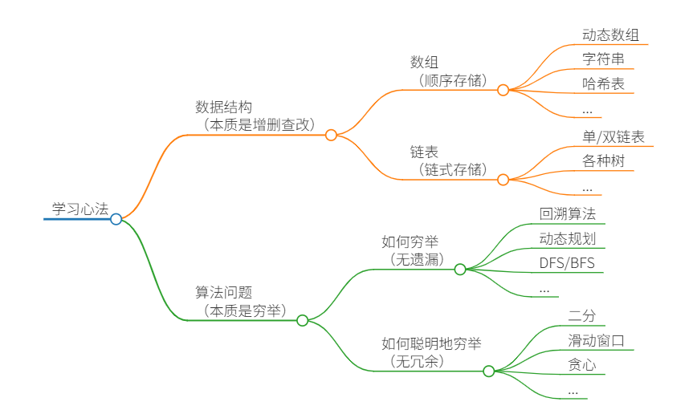

# Aletta_LeetCode
Aletta's LeetCode Learning Journey……

**数据结构**的关键点在于遍历和访问，即**增删查改**等基本操作。种种数据结构，皆为**数组**（顺序存储）和**链表**（链式存储）的变换。

种种**算法**，皆为**穷举**。穷举的关键点在于**无遗漏和无冗余**。熟练掌握算法框架，可以做到无遗漏；充分利用信息，可以做到无冗余。
