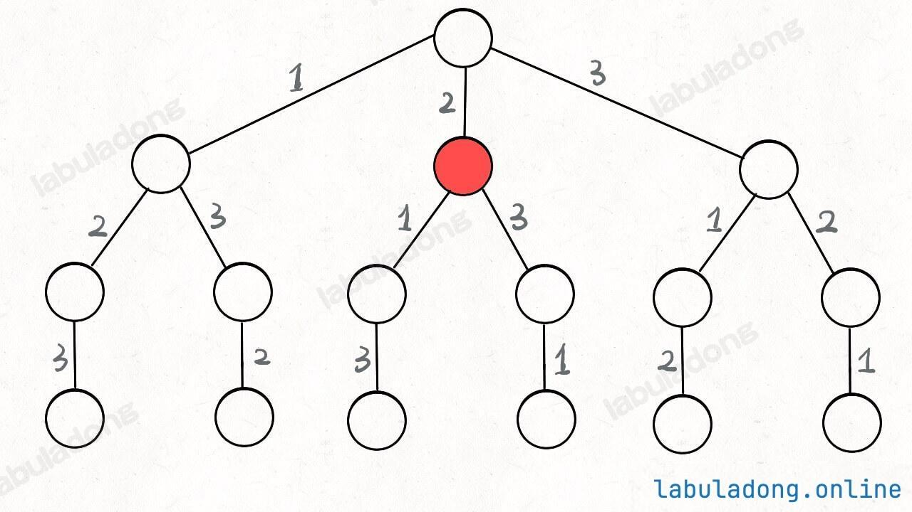
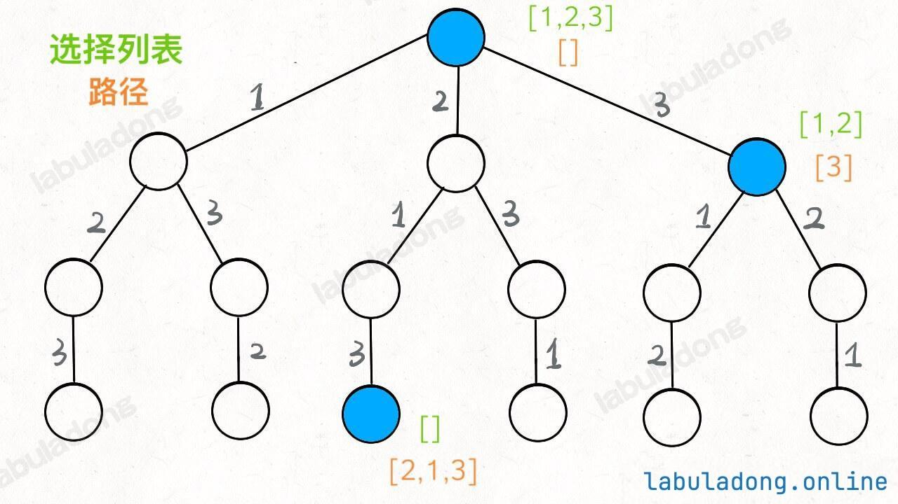
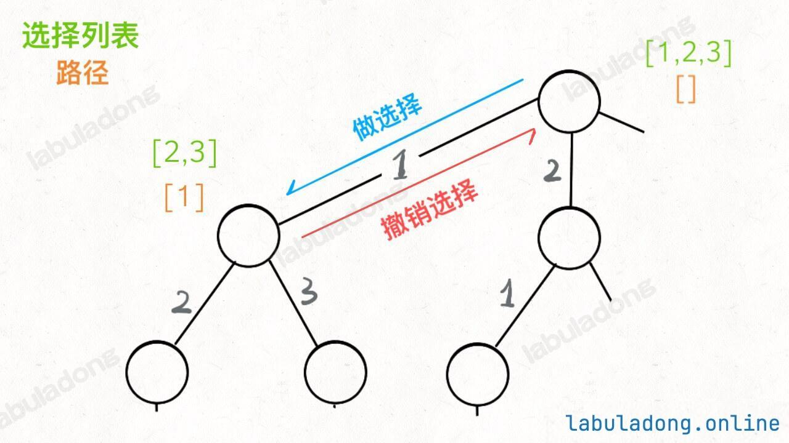

# Problem
https://labuladong.online/zh/problem/leetcode/permutations/description/


# Problem Description
给定一个不含重复数字的数组 nums，返回其所有可能的全排列。你可以按任意顺序返回答案。


# Backtrack Navigation
解决一个回溯问题，实际上就是遍历一棵决策树的过程，树的每个叶子节点存放着一个合法答案。你把整棵树遍历一遍，把叶子节点上的答案都收集起来，就能得到所有的合法答案。站在回溯树的一个节点上，你只需要思考 3 个问题：

1、路径：也就是已经做出的选择。

2、选择列表：也就是你当前可以做的选择。

3、结束条件：也就是到达决策树底层，无法再做选择的条件。

回溯算法代码框架如下：核心就是 for 循环里面的递归，在递归调用之前「做选择」，在递归调用之后「撤销选择」

```python
result = []
def backtrack(路径, 选择列表):
    if 满足结束条件:
        result.add(路径)
        return
    
    for 选择 in 选择列表:
        做选择
        backtrack(路径, 选择列表)
        撤销选择
```


# Solution
只要从根遍历这棵树，记录路径上的数字，其实就是所有的全排列。我们不妨把这棵树称为回溯算法的「决策树」。为啥说这是决策树呢，因为你在每个节点上其实都在做决策。比如说你站在下图的红色节点上：



你现在就在做决策，可以选择 1 那条树枝，也可以选择 3 那条树枝。为啥只能在 1 和 3 之中选择呢？因为 2 这个树枝在你身后，这个选择你之前做过了，而全排列是不允许重复使用数字的。

现在可以解答开头的几个名词：**[2] 就是「路径」，记录你已经做过的选择；[1,3] 就是「选择列表」，表示你当前可以做出的选择；「结束条件」就是遍历到树的底层叶子节点，这里也就是选择列表为空的时候。**

可以把「路径」和「选择」列表作为决策树上每个节点的属性，比如下图列出了几个蓝色节点的属性：



回忆一下前序遍历和后序遍历，前序遍历的代码在进入某一个节点之前的那个时间点执行，后序遍历代码在离开某个节点之后的那个时间点执行。



这里蓝色的“做选择”就是前序，“撤销选择”是后序，因此上面的代码如下：只要在递归之前做出选择，在递归之后撤销刚才的选择，就能正确得到每个节点的选择列表和路径。

```python
result = []
def backtrack(路径, 选择列表):
    if 满足结束条件:
        result.add(路径)
        return
    
    for 选择 in 选择列表:
        # 前序：做选择
        将该选择从选择列表移除
        路径.add(选择)
        # 节点：递归
        backtrack(路径, 选择列表)
        # 后序：撤销选择
        路径.remove(选择)
        将该选择再加入选择列表
```


# Code

## LC version

```python
class Solution:
    def __init__(self):
        self.ans = []
        
    def permute(self, nums: List[int]) -> List[List[int]]:
        # 重点是记录路径和选择
        track = [] # 路径
        # 这里没有显式记录「选择列表」，而是通过 used 数组排除已经存在 track 中的元素，从而推导出当前的选择列表
        used = [False] * len(nums) 
        self.backtrack(nums, track, used)
        return self.ans

    def backtrack(self, nums, track, used):
        # 触发结束条件，加上答案
        if len(track) == len(nums):
            self.ans.append(track.copy())
            return

        # 选择
        for i in range(len(nums)):
            # 排除不合法的选择
            if used[i] == True: # nums[i]已经在track中，跳过
                continue
            # 做选择
            track.append(nums[i])
            used[i] = True
            # 节点
            self.backtrack(nums, track, used)
            # 撤销选择
            track.pop()
            used[i] = False
```

## ACM version

**ACM 模式的注意点：**

- 需要 import 完整的类（包括 sys、typing 等）
- 数据在标准输入流 stdin 中，全部是原始的文本字符串
- 必须用 print() 手动将结果写到标准输出流 stdout
- 需要写 while 或 for line in sys.stdin 循环处理，直到文件结束（EOF）

```python
import sys
from typing import List


class Solution:
    def __init__(self):
        self.ans = []
        
    def permute(self, nums: List[int]) -> List[List[int]]:
        # 重点是记录路径和选择
        track = [] # 路径
        # 这里没有显式记录「选择列表」，而是通过 used 数组排除已经存在 track 中的元素，从而推导出当前的选择列表
        used = [False] * len(nums) 
        self.backtrack(nums, track, used)
        return self.ans

    def backtrack(self, nums, track, used):
        # 触发结束条件，加上答案
        if len(track) == len(nums):
            self.ans.append(track.copy())
            return

        # 选择
        for i in range(len(nums)):
            # 排除不合法的选择
            if used[i] == True: # nums[i]已经在track中，跳过
                continue
            # 做选择
            track.append(nums[i])
            used[i] = True
            # 节点
            self.backtrack(nums, track, used)
            # 撤销选择
            track.pop()
            used[i] = False


lines = sys.stdin.read().strip().split('\n') # 读取所有输入，去掉首尾空白，按照每行划分
index = 0
while index < len(lines):
    n = int(lines[i]) # 提取n
    i += 1
    nums = list(map(int, lines[i].split())) # 提取nums
    i += 1
    result = Solution().permute(nums) # 计算结果
    result.sort() # 按照字典序排序，保证开头是1-3的顺序
    for perm in result:
        print(" ".join(map(str, perm)))
```


# Complexity Analysis
- 时间复杂度：O(n)
- 空间复杂度：O(n)
