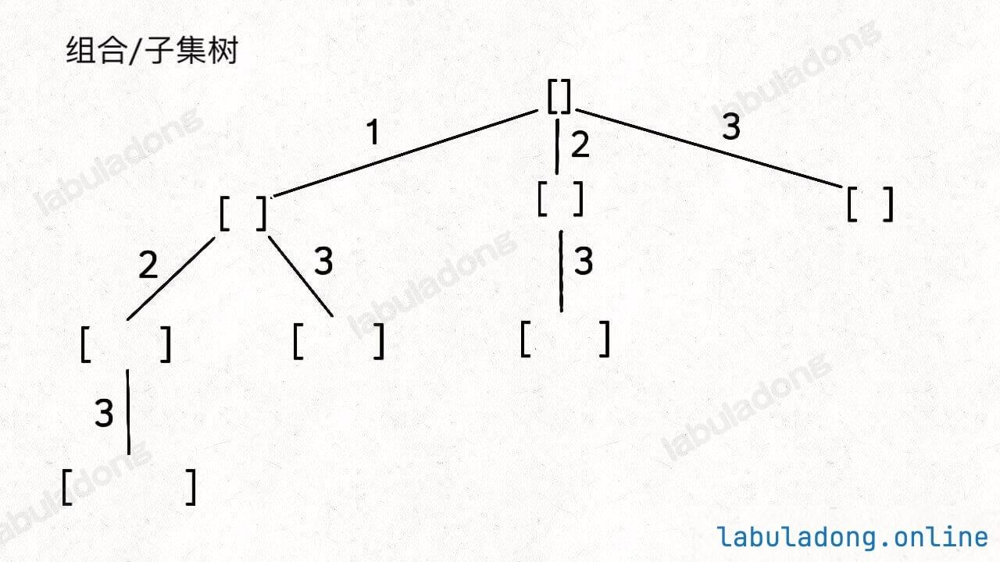
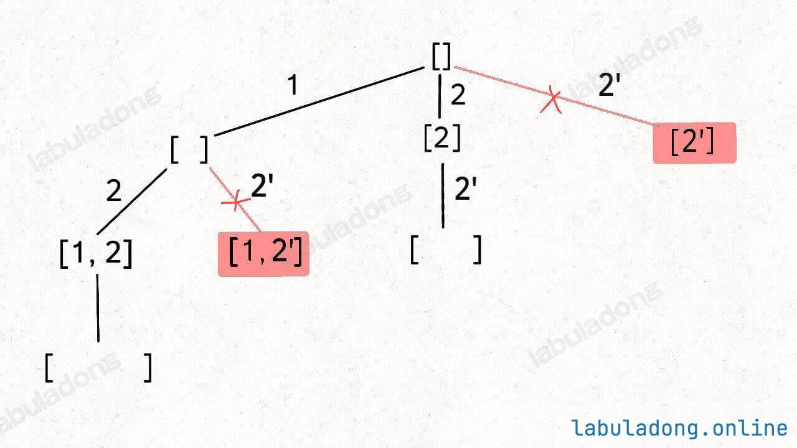

# 1 总领

无论是排列、组合还是子集问题，简单说无非就是让你从序列 nums 中以给定规则取若干元素，主要有以下几种变体：

**形式一、元素无重、不可复选，即 nums 中的元素都是唯一的，每个元素最多只能被使用一次，这也是最基本的形式。**

以组合为例，如果输入 nums = [2,3,6,7]，和为 7 的组合应该只有 [7]。

**形式二、元素可重、不可复选，即 nums 中的元素可以存在重复，每个元素最多只能被使用一次。**

以组合为例，如果输入 nums = [2,5,2,1,2]，和为 7 的组合应该有两种 [2,2,2,1] 和 [5,2]。

**形式三、元素无重、可复选，即 nums 中的元素都是唯一的，每个元素可以被使用若干次。**

以组合为例，如果输入 nums = [2,3,6,7]，和为 7 的组合应该有两种 [2,2,3] 和 [7]。

当然，也可以说有第四种形式，即元素可重可复选。但既然元素可复选，那又何必存在重复元素呢？元素去重之后就等同于形式三，所以这种情况不用考虑。

上面用组合问题举的例子，但**排列、组合、子集问题都可以有这三种基本形式，所以共有 9 种变化**。

除此之外，题目也可以再添加各种限制条件，比如让你求和为 target 且元素个数为 k 的组合，那这么一来又可以衍生出一堆变体，怪不得面试笔试中经常考到排列组合这种基本题型。

但无论形式怎么变化，其本质就是穷举所有解，而这些解呈现树形结构，所以合理使用回溯算法框架，稍改代码框架即可把这些问题一网打尽。

消化下面2张树形图，就能解决所有问题：




首先，组合问题和子集问题其实是等价的，这个后面会讲；至于之前说的三种变化形式，无非是在这两棵树上剪掉或者增加一些树枝罢了。


# 2.1 子集（元素无重不可复选）

例题[子集.md]：https://labuladong.online/zh/problem/leetcode/subsets/description/

代码展示如下：

```python
class Solution:
    def __init__(self):
        self.ans = []
        self.track = [] # 记录回溯算法的递归路径
        
    def subsets(self, nums: List[int]) -> List[List[int]]:
        self.backtrack(nums, 0)
        return self.ans

    def backtrack(self, nums, start):
        # 处理答案，每一个节点的值都是一个子集
        self.ans.append(list(self.track))

        for i in range(start, len(nums)):
            # 做选择
            self.track.append(nums[i])
            self.backtrack(nums, i + 1)
            # 撤销选择
            self.track.pop()
```

# 2.2 组合（元素无重不可复选）

## Problem
https://leetcode.cn/problems/combinations/description/

## Problem Description
给定两个整数 n 和 k，返回范围 [1, n] 中所有可能的 k 个数的组合。你可以按 任何顺序 返回答案。

## Solution

如果你能够成功的生成所有无重子集，那么你稍微改改代码就能生成所有无重组合了。

你比如说，让你在 nums = [1,2,3] 中拿 2 个元素形成所有的组合，你怎么做？

稍微想想就会发现，大小为 2 的所有组合，不就是所有大小为 2 的子集嘛。

所以我说**组合和子集是一样的：大小为 k 的组合就是大小为 k 的子集**。

还是以 nums = [1,2,3] 为例，刚才让你求所有子集，就是把所有节点的值都收集起来；现在你只需要把第 2 层（根节点视为第 0 层）的节点收集起来，就是大小为 2 的所有组合：


## LC version

```python
class Solution:
    def __init__(self):
        self.ans = []
        self.track = []

    def combine(self, n: int, k: int) -> List[List[int]]:
        self.backtrack(1, n, k)
        return self.ans
    
    def backtrack(self, start, n, k):
        # 重点在这里，我只要第k层所有元素：一旦track收集满了就可以返回了
        if k == len(self.track):
            self.ans.append(list(self.track.copy()))
            return

        for i in range(start, n+1): # 需要一个track防止元素重复组合，这样track只会向前遍历
            self.track.append(i)
            self.backtrack(i+1, n, k)
            self.track.pop()
```


# 2.3 排列（元素无重不可复选）

刚才讲的组合/子集问题使用 start 变量保证元素 nums[start] 之后只会出现 nums[start+1..] 中的元素，通过固定元素的相对位置保证不出现重复的子集。

但排列问题本身就是让你穷举元素的位置，nums[i] 之后也可以出现 nums[i] 左边的元素，所以之前的那一套玩不转了，需要额外使用 used 数组来标记哪些元素还可以被选择。

例题[全排列.md]：https://labuladong.online/zh/problem/leetcode/permutations/description/

代码展示如下：

```python
class Solution:
    def __init__(self):
        self.res = []
        self.track = [] # 记录回溯算法的递归路径
        self.used = [] # track 中的元素会被标记为 true
    
    def permute(self, nums: List[int]) -> List[List[int]]:
        self.used = [False] * len(nums)
        self.backtrack(nums)
        return self.res
    
    def backtrack(self, nums: List[int]) -> None:
        # base case，到达叶子节点
        if len(self.track) == len(nums):
            self.res.append(self.track[:])
            return
        
        # 回溯算法标准框架
        for i in range(len(nums)):
            # 已经存在 track 中的元素，不能重复选择
            if self.used[i]:
                continue
            # 做选择
            self.used[i] = True
            self.track.append(nums[i])
            # 进入下一层回溯树
            self.backtrack(nums)
            # 取消选择
            self.track.pop()
            self.used[i] = False
```

# 3.1 子集/组合（元素可重不可复选）

## Problem
https://leetcode.cn/problems/subsets-ii/description/

## Problem Description
给你一个整数数组 nums ，其中可能包含重复元素，请你返回该数组所有可能的 子集（幂集）。

解集 不能 包含重复的子集。返回的解集中，子集可以按 任意顺序 排列。

## Solution

比如输入 nums = [1,2,2]，你应该输出：[ [],[1],[2],[1,2],[2,2],[1,2,2] ]。就以 nums = [1,2,2] 为例，为了区别两个 2 是不同元素，后面我们写作 nums = [1,2,2']。

树形图应该如：

```python
[ 
    [],
    [1],[2],[2'],
    [1,2],[1,2'],[2,2'],
    [1,2,2']
]
```

你可以看到，[2] 和 [1,2] 这两个结果出现了重复，所以我们需要进行剪枝，如果一个节点有多条值相同的树枝相邻，则只遍历第一条，剩下的都剪掉，不要去遍历：



体现在代码上，需要先进行排序，让相同的元素靠在一起，如果发现 nums[i] == nums[i-1]，则跳过。


## LC version

```python
class Solution:
    def __init__(self):
        self.ans = []
        self.track = []

    def subsetsWithDup(self, nums: List[int]) -> List[List[int]]:
        nums.sort() # 重复元素放在一起
        self.backtrack(nums, 0)
        return self.ans
    
    def backtrack(self, nums, start):
        self.ans.append(self.track[:])

        for i in range(start, len(nums)):
            if i > start and nums[i] == nums[i - 1]: # 注意避免i=1情况
                continue
            self.track.append(nums[i])
            self.backtrack(nums, i + 1)
            self.track.pop()
```


# 3.2 排列（元素可重不可复选）

## Problem
https://leetcode.cn/problems/permutations-ii/description/

## Problem Description
给定一个可包含重复数字的序列 nums ，按任意顺序 返回所有不重复的全排列。

比如输入 nums = [1,2,2]，函数返回：[ [1,2,2],[2,1,2],[2,2,1] ]

## Solution

假设输入为 nums = [1,2,2']，标准的全排列算法会得出如下答案：


[
    [1,2,2'],[1,2',2],
    [2,1,2'],[2,2',1],
    [2',1,2],[2',2,1]
]

显然，这个结果存在重复，比如 [1,2,2'] 和 [1,2',2] 应该只被算作同一个排列，但被算作了两个不同的排列。

所以现在的关键在于，如何设计剪枝逻辑，把这种重复去除掉？答案是，保证相同元素在排列中的相对位置保持不变。

比如说 nums = [1,2,2'] 这个例子，我保持排列中 2 一直在 2' 前面。

这样的话，你从上面 6 个排列中只能挑出 3 个排列符合这个条件：[ [1,2,2'],[2,1,2'],[2,2',1] ]

进一步，如果 nums = [1,2,2',2'']，我只要保证重复元素 2 的相对位置固定，比如说 2 -> 2' -> 2''，也可以得到无重复的全排列结果。

仔细思考，应该很容易明白其中的原理：

标准全排列算法之所以出现重复，是因为把相同元素形成的排列序列视为不同的序列，但实际上它们应该是相同的；而如果固定相同元素形成的序列顺序，当然就避免了重复。

那么反映到代码上，你注意看这个剪枝逻辑：

```python
if i > 0 and nums[i] == nums[i - 1] and not self.used[i - 1]:
    continue
```

当出现重复元素时，比如输入 nums = [1,2,2',2'']，2' 只有在 2 已经被使用的情况下才会被选择，同理，2'' 只有在 2' 已经被使用的情况下才会被选择，所以当前面的数字还没被选择(used==False)，那么就应该跳过当前数字（not False = True，要执行continue）

如果不加这条限制，程序会尝试所有下标排列组合（比如"先 2'' 后 2 再 2'"这种路径也会被生成一遍），但这些不同下标组合生成的最终数字序列其实是完全相同的重复排列。

## LC version

```python
class Solution:
    def __init__(self):
        self.ans = []
        self.track = []
        self.used = []

    def permuteUnique(self, nums: List[int]) -> List[List[int]]:
        nums.sort() # 元素有重但是排列不能重复选择，需要加上相对位置判断
        self.used = [False] * len(nums)
        self.backtrack(nums)
        return self.ans
    
    def backtrack(self, nums):
        if len(self.track) == len(nums):
            self.ans.append(self.track.copy())
            return
        
        for i in range(len(nums)):
            if self.used[i]:
                continue
            # 新添加的剪枝逻辑，固定相同的元素在排列中的相对位置
            if i > 0 and nums[i] == nums[i - 1] and not self.used[i - 1]:
                continue
            self.track.append(nums[i])
            self.used[i] = True
            self.backtrack(nums)
            self.track.pop()
            self.used[i] = False
```

# 4.1 子集/组合（元素无重可复选）

例题[组合总和.md]：https://labuladong.online/zh/problem/leetcode/combination-sum/description/

代码参考：

```python
class Solution:
    def __init__(self):
        self.ans = []
        self.track = []
        self.trackSum = 0 # 记录回溯路径track中的路径和
        
    def combinationSum(self, candidates: List[int], target: int) -> List[List[int]]:
        # base case：如果candidates中没有元素
        if len(candidates) == 0:
            return self.ans
        self.backtrack(candidates, 0, target) # 一开始从第一个数字开始，所以是0
        return self.ans
        
    def backtrack(self, candidates, start, target):
        # base case，找到目标和，记录结果
        if self.trackSum == target:
            self.ans.append(self.track.copy())
        # base case，超过目标和，停止向下遍历
        if self.trackSum > target:
            return

        # 回溯算法的框架
        for i in range(start, len(candidates)):
            # 选择 nums[i]
            self.trackSum += candidates[i]
            self.track.append(candidates[i])
            self.backtrack(candidates, i, target) # 可以生长一样的数字，所以是 i
            # 撤销选择
            self.trackSum -= candidates[i]
            self.track.pop()
```

# 4.2 排列（元素无重可复选）

力扣上没有题目直接考察这个场景，我们不妨先想一下，nums 数组中的元素无重复且可复选的情况下，会有哪些排列？

比如输入 nums = [1,2,3]，那么这种条件下的全排列共有 3^3 = 27 种：


[
  [1,1,1],[1,1,2],[1,1,3],[1,2,1],[1,2,2],[1,2,3],[1,3,1],[1,3,2],[1,3,3],
  [2,1,1],[2,1,2],[2,1,3],[2,2,1],[2,2,2],[2,2,3],[2,3,1],[2,3,2],[2,3,3],
  [3,1,1],[3,1,2],[3,1,3],[3,2,1],[3,2,2],[3,2,3],[3,3,1],[3,3,2],[3,3,3]
]

标准的全排列算法利用 used 数组进行剪枝，避免重复使用同一个元素。如果允许重复使用元素的话，直接放飞自我，去除所有 used 数组的剪枝逻辑就行了。

那这个问题就简单了，代码如下：

```python
class Solution:
    
    def __init__(self):
        self.res = []
        self.track = []
    
    def permuteRepeat(self, nums: List[int]) -> List[List[int]]:
        self.backtrack(nums)
        return self.res

    # 回溯算法核心函数
    def backtrack(self, nums: List[int]) -> None:
        # base case，到达叶子节点
        if len(self.track) == len(nums):
            # 收集叶子节点上的值
            self.res.append(self.track[:])
            return

        # 回溯算法标准框架
        for i in range(len(nums)):
            # 做选择
            self.track.append(nums[i])
            # 进入下一层回溯树
            self.backtrack(nums)
            # 取消选择
            self.track.pop()
```

# 5 总结

ps. base case（基准情况、递归终止条件）是递归函数停止继续调用自己的条件

由于子集问题和组合问题本质上是一样的，无非就是 base case 有一些区别，所以把这两个问题放在一起看。

形式一、元素无重不可复选，即 nums 中的元素都是唯一的，每个元素最多只能被使用一次，backtrack 核心代码如下：

```python
# 组合/子集问题回溯算法框架：因为无重不可复选，所以需要一个start参数保证树一直往下遍历，不回头
def backtrack(nums: List[int], start: int):
    # 回溯算法标准框架
    for i in range(start, len(nums)):
        # 做选择
        track.append(nums[i])
        # 注意参数
        backtrack(nums, i + 1) 
        # 撤销选择
        track.pop()

# 排列问题回溯算法框架：需要引入used数组
def backtrack(nums: List[int]):
    for i in range(len(nums)):
        # 剪枝逻辑
        if used[i]:
            continue
        # 做选择
        used[i] = True
        track.append(nums[i])
        backtrack(nums)
        # 撤销选择
        track.pop()
        used[i] = False
```

形式二、元素可重不可复选，即 nums 中的元素可以存在重复，每个元素最多只能被使用一次，其关键在于排序和剪枝，backtrack 核心代码如下：

```python
nums.sort()
# 组合/子集问题回溯算法框架：可重复不可复选，标识为2和2'，注意sort之后排列在相邻位置然后跳过
def backtrack(nums: List[int], start: int):
    # 回溯算法标准框架
    for i in range(start, len(nums)):
        # 剪枝逻辑，跳过值相同的相邻树枝
        if i > start and nums[i] == nums[i - 1]:
            continue
        # 做选择
        track.append(nums[i])
        # 注意参数
        backtrack(nums, i + 1)
        # 撤销选择
        track.pop()


nums.sort()
# 排列问题回溯算法框架：除了上述条件还要加上used[i-1]的判断
def backtrack(nums: List[int]):
    for i in range(len(nums)):
        # 剪枝逻辑
        if used[i]:
            continue
        # 剪枝逻辑，固定相同的元素在排列中的相对位置
        if i > 0 and nums[i] == nums[i - 1] and not used[i - 1]:
            continue
        # 做选择
        used[i] = True
        track.append(nums[i])

        backtrack(nums)
        # 撤销选择
        track.pop()
        used[i] = False
```

形式三、元素无重可复选，即 nums 中的元素都是唯一的，每个元素可以被使用若干次，只要删掉去重逻辑即可，backtrack 核心代码如下：

```python
# 组合/子集问题回溯算法框架：注意start可以还是从i开始，不前进
def backtrack(nums: List[int], start: int):
    # 回溯算法标准框架
    for i in range(start, len(nums)):
        # 做选择
        track.append(nums[i])
        # 注意参数
        backtrack(nums, i)
        # 撤销选择
        track.pop()


# 排列问题回溯算法框架：毫无限制
def backtrack(nums: List[int]):
    for i in range(len(nums)):
        # 做选择
        track.append(nums[i])
        backtrack(nums)
        # 撤销选择
        track.pop()
```
