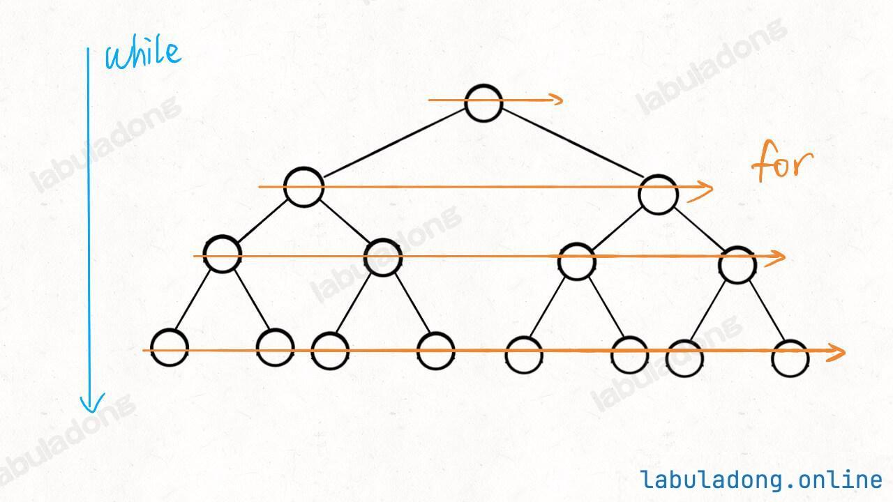
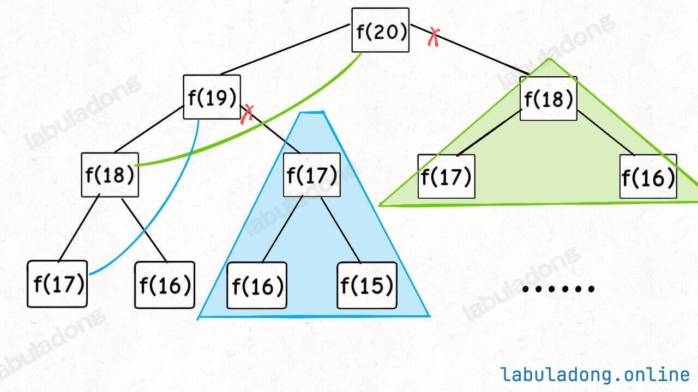
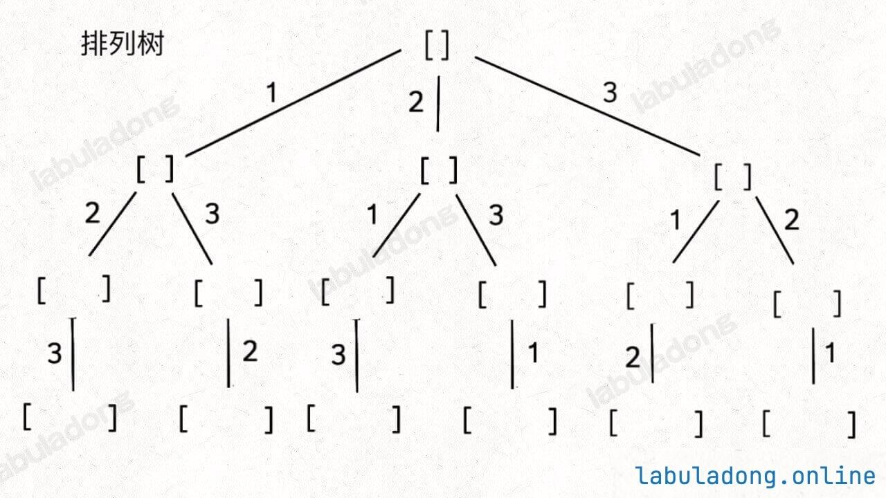

# 树这种数据结构
树结构，用数组实现就是「堆」，因为**堆是一个完全二叉树**，**用数组存储**不需要节点指针，操作也比较简单，经典应用有二叉堆；**用链表实现就是很常见的那种树，因为不一定是完全二叉树，所以不适合用数组存储**。为此，在这种链表「树」结构之上，又衍生出各种巧妙的设计，比如 二叉搜索树、AVL 树、红黑树、区间树、B 树等等，以应对不同的问题。

PS：如果是链式存储，数据结构如下图


```python
class TreeNode:
    def __init__(self, val = 0, left = None, right = None):
        self.val = val
        self.left = left
        self.right = right
```

PS：堆有大顶堆、小顶堆，比如大顶堆其实就是利用完全二叉树的结构来维护的一维数组。


# 几种二叉树类型
满二叉树：满二叉树就是每一层节点都是满的，假设深度为 h，那么总节点数就是 2^h - 1


完全二叉树：二叉树的每一层的节点都紧凑靠左排列，且除了最后一层，其他每层都必须是满的

完全二叉树的特点：由于它的节点紧凑排列，如果从左到右从上到下对它的每个节点编号，那么父子节点的索引存在明显的规律。

这个特点在讲到二叉堆核心原理和线段树核心原理时会用到：完全二叉树可以用数组来存储，不需要真的构建链式节点。


二叉搜索树：对于树中的每个节点，其左子树的每个节点的值都要小于这个节点的值，右子树的每个节点的值都要大于这个节点的值

BST 是非常常用的数据结构。因为左小右大的特性，可以让我们在 BST 中快速找到某个节点，或者找到某个范围内的所有节点，这是 BST 的优势所在。


高度平衡二叉树：高度平衡二叉树（Height-Balanced Binary Tree）是一种特殊的二叉树，它的「每个节点」的左右子树的高度差不超过 1


# 二叉树的遍历方式
以下图为例


**注意：DFS 算法常用来穷举所有路径，BFS 算法常用来寻找最短路径**

**DFS 算法属于遍历的思路，它的关注点在单个「节点」。**

## DFS（深度优先搜索）
沿一条路径尽可能深入，直到叶子节点再回溯；代码实现上，这一类可以靠递归。

（1）先序遍历（先遍历根节点，然后左节点，右节点）

遍历结果 1 2 3 4 5 6 7

（2）中序遍历（先遍历左节点，然后根节点，然后右节点）

遍历结果 3 2 4 1 6 5 7

（3）后序遍历（先遍历左右节点，然后遍历根节点）

遍历结果 3 4 2 6 7 5 1

```python
# 二叉树的遍历框架：在 traverse 函数中不同位置写代码，分别实现前中后序遍历
def traverse(root):
    if root is None:
        return
    # 前序位置
    traverse(root.left)
    # 中序位置
    traverse(root.right)
    # 后序位置
```

## BFS（广度优先搜索）

按照层次遍历（每层从左到右遍历节点），经常用队列实现

遍历结果为：1 2 5 3 4 6 7



```python
我们需要借助队列来完成层次遍历的工作，因此

节点 1 入队，得到子节点 2，5 ，[A]
1 出队，第一个节点是 1 ，2、5 入队，得到 [2、5] —— 1
2 出队，其子节点 34 入队 [5、3、4] —— 1、2
5 出队，其子节点 67 入队 [3467] —— 1、2、5
3467 都没有子节点，于是都出队得到 —— 1、2、5、3、4、6、7

from collections import deque

def levelOrderTraverse(root):
    if root is None:
        return
    q = deque()
    q.append(root)

    while q:
        cur = q.popleft()
        print(cur.val)

        # 把 cur 的左右子节点加入队列
        if cur.left is not None:
            q.append(cur.left)
        if cur.right is not None:
            q.append(cur.right)
```

上面这种写法的缺点是，无法知道当前节点在第几层，于是就有了：
```python
from collections import deque

def levelOrderTraverse(root):
    if root is None:
        return
    q = deque()
    q.append(root)
    depth = 1 # 记录当前遍历到的层数（根节点视为第 1 层）

    while q:
        sz = len(q) # 队列长度，也就是某一层我要处理多少个节点
        for i in range(sz):
            cur = q.popleft()
            print(f"depth = {depth}, val = {cur.val}") # 访问 cur 节点，同时知道它所在的层数

            # 把 cur 的左右子节点加入队列
            if cur.left is not None:
                q.append(cur.left)
            if cur.right is not None:
                q.append(cur.right)
        depth += 1
```

根据上面的解法，我们每向下遍历一层，就给 depth 加 1，可以理解为每条树枝的权重是 1，二叉树中每个节点的深度，其实就是从根节点到这个节点的路径权重和，且同一层的所有节点，路径权重和都是相同的。那么假设，**如果每条树枝的权重可以是任意值**，现在让你层序遍历整棵树，打印每个节点的路径权重和：
```python
class State:
    def __init__(self, node, depth):
        self.node = node
        self.depth = depth

def levelOrderTraverse(root):
    if root is None:
        return
    q = deque()
    q.append(State(root, 1)) # 根节点的路径权重和是 1

    while q:
        cur = q.popleft()
        print(f"depth = {cur.depth}, val = {cur.node.val}") # 访问 cur 节点，同时知道它的路径权重和

        # 把 cur 的左右子节点加入队列
        if cur.node.left is not None:
            q.append(State(cur.node.left, cur.depth + 1))
        if cur.node.right is not None:
            q.append(State(cur.node.right, cur.depth + 1))
```

# 很重要的解题思维

## 两类不同的思维模式

二叉树解题的思维模式分两类：

1、**回溯思维（遍历）**：是否可以通过遍历一遍二叉树得到答案？如果可以，用一个 traverse 函数配合外部变量（写在__init__里面）来实现。

2、**动态规划思维（分解问题）**：是否可以定义一个递归函数，通过子问题（子树）的答案推导出原问题的答案？如果可以，写出这个递归函数的定义，并充分利用这个函数的返回值。

无论使用哪种思维模式，你都需要思考：

（1）**如果单独抽出一个二叉树节点，它需要做什么事情？**

（2）**需要在什么时候（前/中/后序位置）做？**

## DP（分解问题）

**动态规划算法属于分解问题（分治）的思路，它的关注点在整棵「子树」。**




比如：给你一棵二叉树，请你用分解问题的思路写一个 count 函数，计算这棵二叉树共有多少个节点。

```python
def count(root):
    if root is None:
        return 0
    leftCount = count(root.left)
    rightCount = count(root.right)
    # 后序位置，左右子树节点数加上自己就是整棵树的节点数
    return leftCount + rightCount + 1
```

## 回溯（遍历问题）

**回溯算法属于遍历的思路，它的关注点在节点间的「树枝」。**



给你一棵二叉树，请你用遍历的思路写一个 traverse 函数，打印出遍历这棵二叉树的过程

```python
def traverse(root):
    if root is None:
        return

    print("从节点 %s 进入节点 %s", root, root.left)
    traverse(root.left)
    print("从节点 %s 回到节点 %s", root.left, root)

    print("从节点 %s 进入节点 %s", root, root.right)
    traverse(root.right)
    print("从节点 %s 回到节点 %s", root.right, root)
```

PS：**DFS 算法属于遍历的思路，它的关注点在单个「节点」。**


## 二叉树前中后序深层含义

所谓前序位置，就是刚进入一个节点（元素）的时候，后序位置就是即将离开一个节点（元素）的时候

前序位置的代码在刚刚进入一个二叉树节点的时候执行；后序位置的代码在将要离开一个二叉树节点的时候执行；中序位置的代码在一个二叉树节点左子树都遍历完，即将开始遍历右子树的时候执行。（**中序位置主要用在 BST 场景中**，你完全可以把 BST 的中序遍历认为是遍历有序数组。）

仔细观察，前中后序位置的代码，能力依次增强。前序位置（root-lef-right）的代码只能从函数参数中获取父节点传递来的数据（无法访问left和right）。中序位置（left-root-right）的代码不仅可以获取参数数据，还可以获取到左子树通过函数返回值传递回来的数据。**后序位置（left-root-right）的代码最强，不仅可以获取参数数据，还可以同时获取到左右子树通过函数返回值传递回来的数据**。所以，某些情况下把代码移到后序位置效率最高；有些事情，只有后序位置的代码能做。
