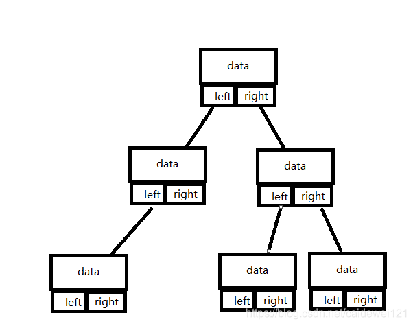
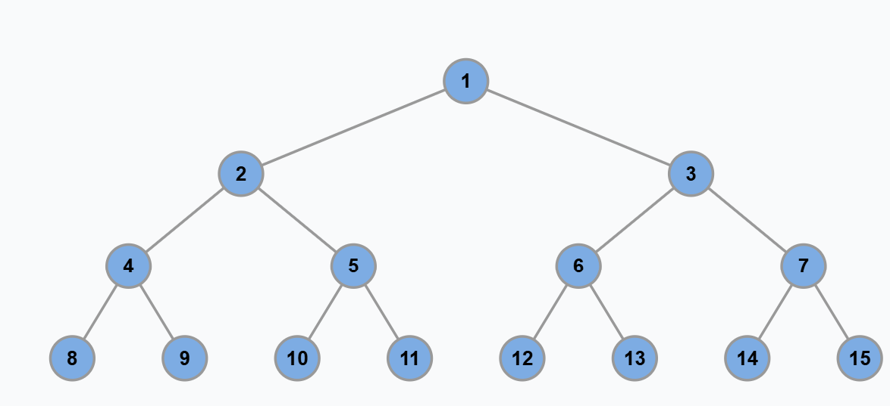
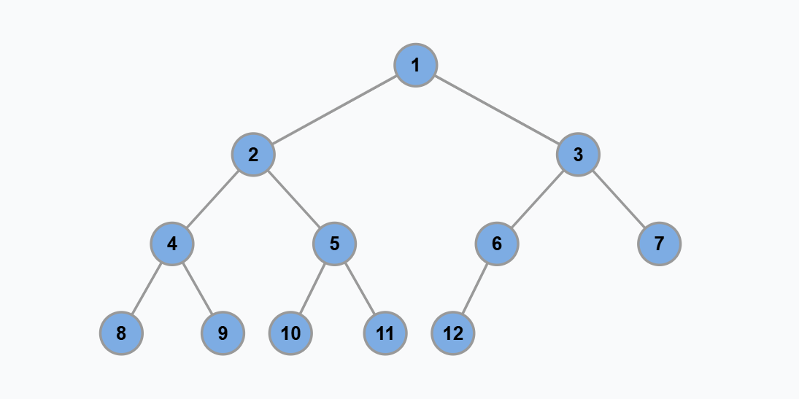
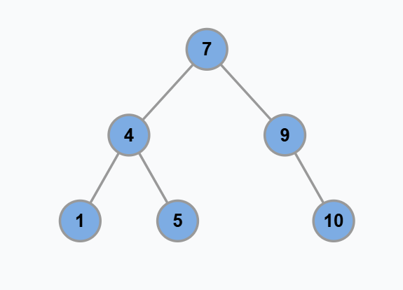
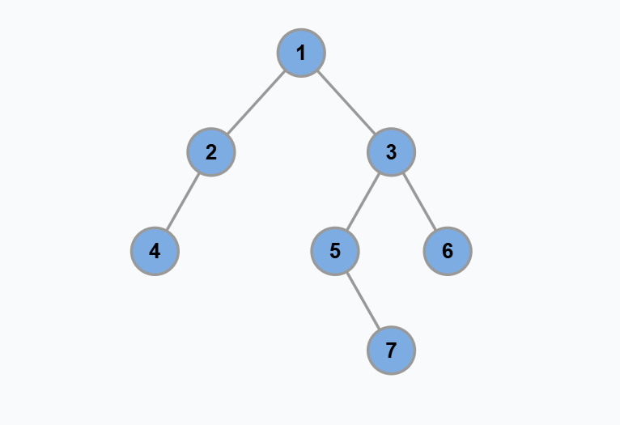
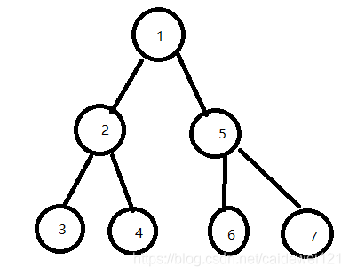

# 关于树这种数据结构
树结构，用数组实现就是「堆」，因为**堆是一个完全二叉树**，**用数组存储**不需要节点指针，操作也比较简单，经典应用有二叉堆；**用链表实现就是很常见的那种树，因为不一定是完全二叉树，所以不适合用数组存储**。为此，在这种链表「树」结构之上，又衍生出各种巧妙的设计，比如 二叉搜索树、AVL 树、红黑树、区间树、B 树等等，以应对不同的问题。

PS：如果是链式存储，数据结构如下图



```python
class TreeNode:
    def __init__(self, val = 0, left = None, right = None):
        self.val = val
        self.left = left
        self.right = right
```

PS：堆有大顶堆、小顶堆，比如大顶堆其实就是利用完全二叉树的结构来维护的一维数组。

# 基本概念
子节点、父节点、根结点、叶子结点

# 几种二叉树类型
满二叉树：满二叉树就是每一层节点都是满的，假设深度为 h，那么总节点数就是 2^h - 1



完全二叉树：二叉树的每一层的节点都紧凑靠左排列，且除了最后一层，其他每层都必须是满的

完全二叉树的特点：由于它的节点紧凑排列，如果从左到右从上到下对它的每个节点编号，那么父子节点的索引存在明显的规律。

这个特点在讲到二叉堆核心原理和线段树核心原理时会用到：完全二叉树可以用数组来存储，不需要真的构建链式节点。



二叉搜索树：对于树中的每个节点，其左子树的每个节点的值都要小于这个节点的值，右子树的每个节点的值都要大于这个节点的值

BST 是非常常用的数据结构。因为左小右大的特性，可以让我们在 BST 中快速找到某个节点，或者找到某个范围内的所有节点，这是 BST 的优势所在。



高度平衡二叉树：高度平衡二叉树（Height-Balanced Binary Tree）是一种特殊的二叉树，它的「每个节点」的左右子树的高度差不超过 1



# 二叉树的遍历方式
以下图为例



第一种：DFS（深度优先搜索）沿一条路径尽可能深入，直到叶子节点再回溯

代码实现上，这一类可以靠递归。

（1）先序遍历（先遍历根节点，然后左节点，右节点）

遍历结果 1 2 3 4 5 6 7

（2）中序遍历（先遍历左节点，然后根节点，然后右节点）

遍历结果 3 2 4 1 6 5 7

（3）后序遍历（先遍历左右节点，然后遍历根节点）

遍历结果 3 4 2 6 7 5 1


第二种：BFS（广度优先搜索）按照层次遍历，经常用队列实现

层次遍历（每层从左到右遍历节点）

遍历结果为：1 2 5 3 4 6 7

```python
我们需要借助队列来完成层次遍历的工作，因此

节点 1 入队，得到子节点 2，5 ，[A]
1 出队，第一个节点是 1 ，2、5 入队，得到 [2、5] —— 1
2 出队，其子节点 34 入队 [5、3、4] —— 1、2
5 出队，其子节点 67 入队 [3467] —— 1、2、5
3467 都没有子节点，于是都出队得到 —— 1、2、5、3、4、6、7
```

# 很重要的解题思维

二叉树解题的思维模式分两类：

1、是否可以通过遍历一遍二叉树得到答案？如果可以，用一个 traverse 函数配合外部变量来实现，这叫「遍历」的思维模式。

2、是否可以定义一个递归函数，通过子问题（子树）的答案推导出原问题的答案？如果可以，写出这个递归函数的定义，并充分利用这个函数的返回值，这叫「分解问题」的思维模式。

无论使用哪种思维模式，你都需要思考：

（1）如果单独抽出一个二叉树节点，它需要做什么事情？

（2）需要在什么时候（前/中/后序位置）做？

（3）其他的节点不用你操心，递归函数会帮你在所有节点上执行相同的操作。

总结如果使用“遍历”的思维方式：

1. 这题能不能用「遍历」的思维模式解决？

2. 单独抽出一个节点，需要让它做什么？

3. 需要在什么时候做（前中后序位置）？

总结如果使用“分解”的思维方式：

1. 这题能不能用「递归」的思维模式解决？

2. 单独抽出一个节点，需要让它做什么？

3. 需要在什么时候做（前中后序位置）？
