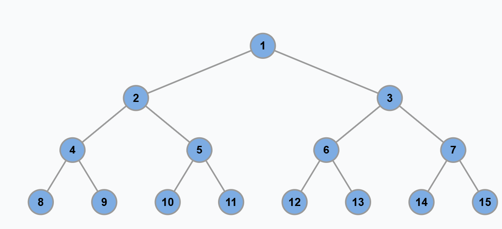
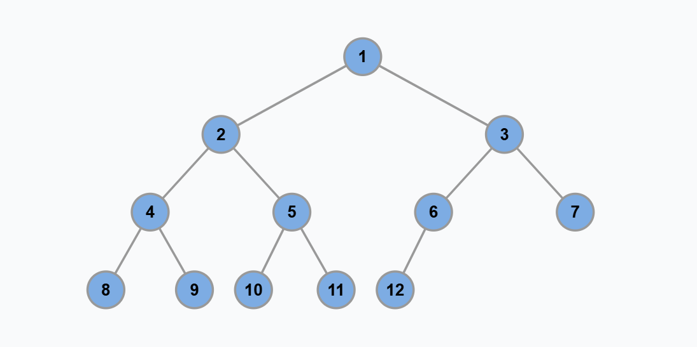
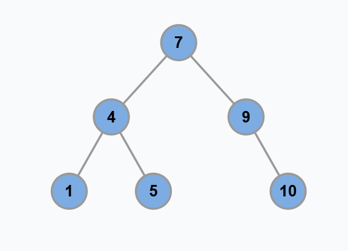
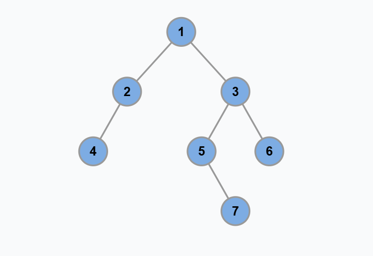

# 基本概念
子节点、父节点、根结点、叶子结点

# 几种二叉树类型
满二叉树：满二叉树就是每一层节点都是满的，假设深度为 h，那么总节点数就是 2^h - 1

完全二叉树：二叉树的每一层的节点都紧凑靠左排列，且除了最后一层，其他每层都必须是满的

完全二叉树的特点：由于它的节点紧凑排列，如果从左到右从上到下对它的每个节点编号，那么父子节点的索引存在明显的规律。

这个特点在讲到二叉堆核心原理和线段树核心原理时会用到：完全二叉树可以用数组来存储，不需要真的构建链式节点。

二叉搜索树：对于树中的每个节点，其左子树的每个节点的值都要小于这个节点的值，右子树的每个节点的值都要大于这个节点的值

BST 是非常常用的数据结构。因为左小右大的特性，可以让我们在 BST 中快速找到某个节点，或者找到某个范围内的所有节点，这是 BST 的优势所在。

高度平衡二叉树：高度平衡二叉树（Height-Balanced Binary Tree）是一种特殊的二叉树，它的「每个节点」的左右子树的高度差不超过 1

# 很重要的解题思维

二叉树解题的思维模式分两类：

1、是否可以通过遍历一遍二叉树得到答案？如果可以，用一个 traverse 函数配合外部变量来实现，这叫「遍历」的思维模式。

2、是否可以定义一个递归函数，通过子问题（子树）的答案推导出原问题的答案？如果可以，写出这个递归函数的定义，并充分利用这个函数的返回值，这叫「分解问题」的思维模式。

无论使用哪种思维模式，你都需要思考：

（1）如果单独抽出一个二叉树节点，它需要做什么事情？

（2）需要在什么时候（前/中/后序位置）做？

（3）其他的节点不用你操心，递归函数会帮你在所有节点上执行相同的操作。

总结如果使用“遍历”的思维方式：

1. 这题能不能用「遍历」的思维模式解决？

2. 单独抽出一个节点，需要让它做什么？

3. 需要在什么时候做（前中后序位置）？

总结如果使用“分解”的思维方式：

1. 这题能不能用「递归」的思维模式解决？

2. 单独抽出一个节点，需要让它做什么？

3. 需要在什么时候做（前中后序位置）？
