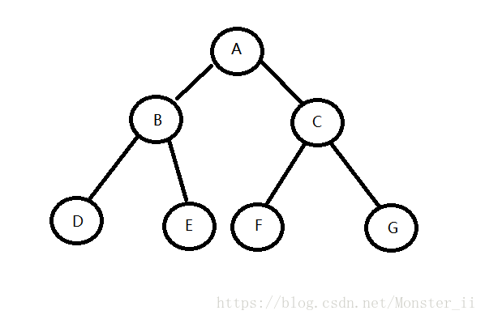

# Problem
https://labuladong.online/zh/problem/leetcode/binary-tree-inorder-traversal/description/


# Problem Description
给定一个二叉树的根节点 root，返回它的 中序 遍历。

# Key Points
**根->左->右便是前序遍历，左->根->右便是中序遍历，左->右->根便是后序遍历。**

以下图为例，前序——ABDECFG，中序——DBEAFCG，后序——DEBFGCA：



**最后一个知识点，二叉搜索树（BST）的中序遍历结果是有序的，这是 BST 的一个重要性质。**


# Code

## ACM version

```python
import sys
from collections import deque


# 定义树节点
class TreeNode:
    def __init__(self, val=0, left=None, right=None):
        self.val = val
        self.left = left
        self.right = right


# 核心函数中序遍历
class Solution:
    def inorderTraversal(self, root):
        res = []
        
        def traverse(node):
            if node is None:
                return
            traverse(node.left)
            res.append(node.val)
            traverse(node.right)
        
        traverse(root)
        return res


# 构建二叉树：'1 # 2 3' -> BinaryTree
def build_tree(s):
    tokens = s.strip().split()
    if not tokens:
        return None
        
    root = TreeNode(int(tokens[0]))
    q = deque([root]) # 不用index，直接队列popleft
    i = 1 # 从root之后的一个节点开始
    
    while q and i < len(tokens):
        node = q.popleft()
        if i < len(tokens): # 左孩子
            t = tokens[i]
            i += 1
            if t != '#':
                node.left = TreeNode(int(t))
                q.append(node.left)
        if i < len(tokens): # 右孩子
            t = tokens[i]
            i += 1
            if t != '#':
                node.right = TreeNode(int(t))
                q.append(node.right)
    return root


# 主函数
data = sys.stdin.read().strip().split('\n')
i = 0
while i < len(data):
    length = int(data[i]); i += 1
    
    sequence = data[i] if i < len(data) else ''; i += 1 # 读下一行作为层序序列（可能是空行）
    root = build_tree(sequence)
    
    result = Solution().inorderTraversal(root)
    print(' '.join(str(v) for v in result))
```

# Complexity Analysis
- 时间复杂度：O(n)，每个节点访问一次被加入
- 空间复杂度：O(n)，最坏情况是链状树，高度O(n)
