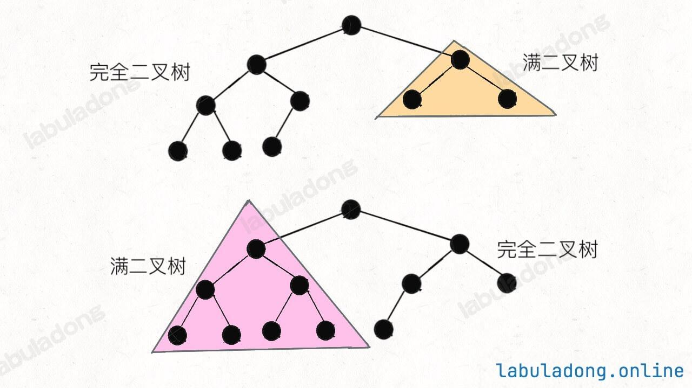

# Problem
https://leetcode.cn/problems/count-complete-tree-nodes/description/


# Problem Description

给你一棵 完全二叉树 的根节点 root ，求出该树的节点个数。

完全二叉树 的定义如下：在完全二叉树中，除了最底层节点可能没填满外，其余每层节点数都达到最大值，并且最下面一层的节点都集中在该层最左边的若干位置。若最底层为第 h 层（从第 0 层开始），则该层包含 1~ 2^h 个节点。


# Solution
计算普通二叉树的节点个数，使用递归思想，总节点个数就是左子树节点个数+右子树节点个数：

```python
def countNodes(root: TreeNode) -> int:
    if root == None:
        return 0
    return 1 + countNodes(root.left) + countNodes(root.right)
```

计算满二叉树节点个数，就是2^h-1：

```python
def countNodes(root: TreeNode) -> int:
    h = 0
    while root: # 计算树的高度
        root = root.left
        h += 1
    return 2 ** h - 1
```

有趣的是，一棵完全二叉树，左右子树里面至少有一棵是满二叉树，所以一定会触发 hl == hr，只消耗 O(logN) 的复杂度而不会继续递归：




# Code

## LC version

```python
class Solution:
    def countNodes(self, root: TreeNode) -> int:
        l = root
        r = root
        hl = 0
        hr = 0
        # 沿最左侧和最右侧分别计算高度
        while l is not None:
            l = l.left
            hl += 1
        while r is not None:
            r = r.right
            hr += 1
        # 如果左右侧计算的高度相同，则是一棵满二叉树
        if hl == hr:
            return pow(2, hl) - 1
        # 如果左右侧的高度不同，则按照普通二叉树的逻辑计算
        return 1 + self.countNodes(root.left) + self.countNodes(root.right)
```


# Complexity Analysis
- 时间复杂度：O(logN*logN)
- 空间复杂度：O(1)
