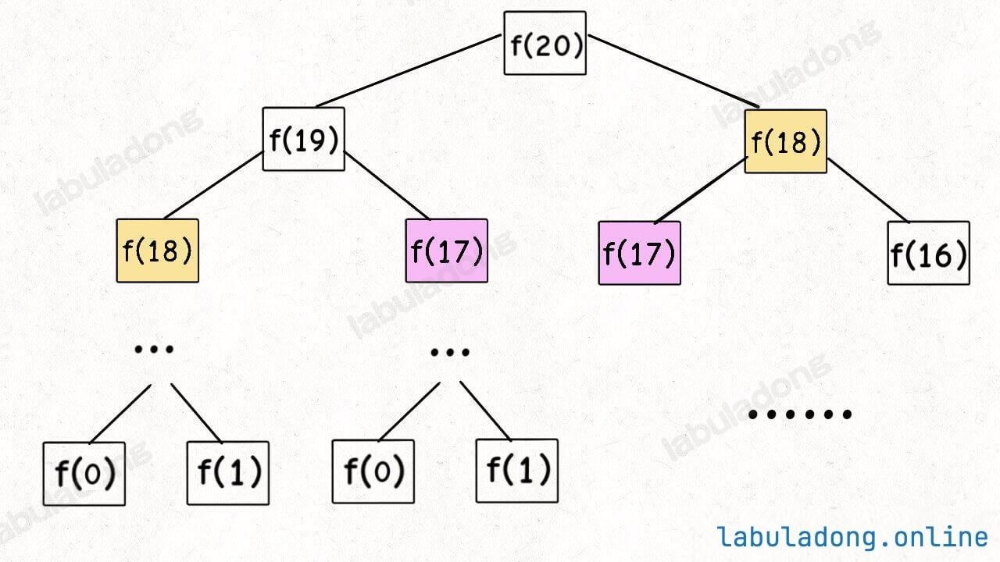
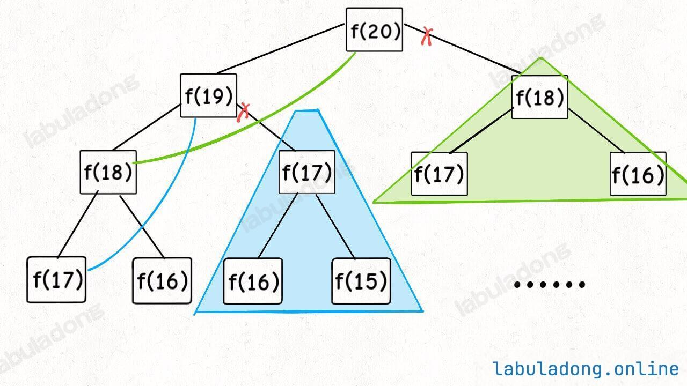
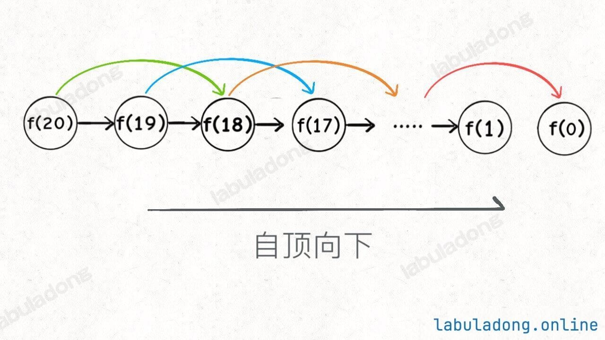
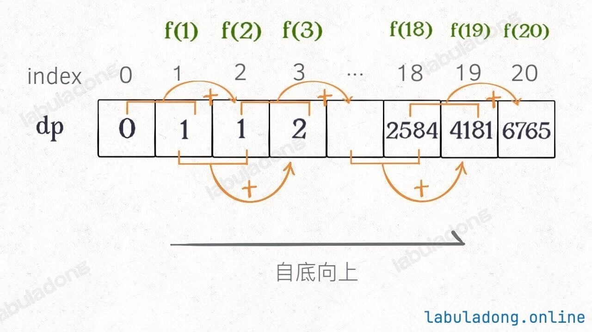

# 动态规划大纲
首先，**动态规划问题的一般形式就是求最值**。动态规划其实是运筹学的一种最优化方法，只不过在计算机问题上应用比较多，比如说让你求最长递增子序列呀，最小编辑距离呀等等。

既然是要求最值，核心问题是什么呢？求解动态规划的核心问题是**穷举**。因为要求最值，肯定要把所有可行的答案穷举出来，然后在其中找最值呗。

动态规划这么简单，就是穷举就完事了？我看到的动态规划问题都很难啊！

首先，虽然动态规划的核心思想就是穷举求最值，但是问题可以千变万化，穷举所有可行解其实并不是一件容易的事，需要你熟练掌握递归思维，只有列出正确的「**状态转移方程**」，才能正确地穷举。

而且，你需要判断算法问题是否具备「**最优子结构**」，是否能够通过子问题的最值得到原问题的最值。

另外，动态规划问题存在「**重叠子问题**」，如果暴力穷举的话效率会很低，所以需要你使用「备忘录」或者「DP table」来优化穷举过程，避免不必要的计算。

以上提到的重叠子问题、最优子结构、状态转移方程就是动态规划三要素。具体什么意思等会会举例详解，但是在实际的算法问题中，写出状态转移方程是最困难的，这也就是为什么很多朋友觉得动态规划问题困难的原因，我来提供我总结的一个思维框架，辅助你思考状态转移方程：

**明确「状态」-> 明确「选择」 -> 定义 dp 数组/函数的含义**。

```python
# 自顶向下递归的动态规划
def dp(状态1, 状态2, ...):
    for 选择 in 所有可能的选择:
        # 此时的状态已经因为做了选择而改变
        result = 求最值(result, dp(状态1, 状态2, ...))
    return result

# 自底向上迭代的动态规划
# 初始化 base case
dp[0][0][...] = base case
# 进行状态转移
for 状态1 in 状态1的所有取值：
    for 状态2 in 状态2的所有取值：
        for ...
            dp[状态1][状态2][...] = 求最值(选择1，选择2...)
```


# 斐波那契数列

## 原问题

斐波那契数 （通常用 F(n) 表示）形成的序列称为 斐波那契数列 。该数列由 0 和 1 开始，后面的每一项数字都是前面两项数字的和。也就是：

F(0) = 0，F(1) = 1

F(n) = F(n - 1) + F(n - 2)，其中 n > 1

给定 n ，请计算 F(n) 。

## 暴力递归

```python
# f(n) 计算第 n 个斐波那契数
def fib(n: int) -> int:
    # base case
    if n == 0 or n == 1:
        return n
    return fib(n - 1) + fib(n - 2)
```

递归算法的时间复杂度怎么计算？就是用**子问题个数乘以解决一个子问题需要的时间**。

首先计算子问题个数，即递归树中节点的总数。这棵递归树的高度为 n，所以二叉树的节点总数为 2^n。

然后计算解决一个子问题的时间，在本算法中，没有循环，只有 f(n - 1) + f(n - 2) 一个加法操作，时间为 O(1)。

所以，这个算法的时间复杂度为二者相乘，即 O(2^n)，指数级别，爆炸。

观察递归树，很明显发现了算法低效的原因：存在大量重复计算。比如 f(18) 被计算了两次，而且你可以看到，以 f(18) 为根的这个递归树体量巨大，多算一遍，会耗费大量的时间。更何况还不止 f(18) 这一个节点被重复计算，所以这个算法效率很差。



# 带备忘录的递归解法

即然耗时的原因是重复计算，那么我们可以造一个「备忘录」，**每次算出某个子问题的答案后顺便记到「备忘录」里**；每次遇到一个子问题别急着计算，先去「备忘录」里查一查，如果发现之前已经解决过这个问题了，直接把答案拿出来用，不要再耗时去计算了。

对于斐波那契数列问题，我们需要一个备忘录记录子问题 f(x) 的值，其中 x 是一个非负整数，所以一般用**一个一维数组 memo** 充当备忘录就可以了，**让 memo[x] 存储子问题 f(x) 的返回值**。

当然，你也可以用一个哈希表来存储，思想都是一样的。

```python
def fib(n: int) -> int:
    # 备忘录全初始化为 -1，因为斐波那契数肯定是非负整数，所以初始化为特殊值 -1 表示未计算
    # 因为数组的索引从 0 开始，所以需要 n + 1 个空间，这样才能把 `f(0) ~ f(n)` 都记录到 memo 中
    memo = [-1] * (n + 1)
    return self.dp(memo, n) # 使用memo求f(n)的值

def dp(memo: list, n: int) -> int: # 带着备忘录进行递归
    if n == 0 or n == 1: # base case
        return n
    if memo[n] != -1: # 已经计算过，不用再计算了
        return memo[n]
    memo[n] = self.dp(memo, n - 1) + self.dp(memo, n - 2) # 在返回结果之前，存入备忘录
    return memo[n]
```

实际上，带「备忘录」的递归算法，把一棵存在巨量冗余的递归树通过「剪枝」，改造成了一幅不存在冗余的递归图，极大减少了子问题（即递归图中节点）的个数，每个子问题都只会被计算一次，这是一种“自顶向下”的解法，f(20) -> f(19) -> f(18) ……



递归算法的时间复杂度怎么计算？就是用子问题个数乘以解决一个子问题需要的时间。

子问题个数，即图中节点的总数，由于本算法不存在冗余计算，子问题就是 f(0), f(1), f(2) ... f(20)，数量和输入规模 n = 20 成正比，所以子问题个数为 O(n)。

解决一个子问题的时间，同上，没有什么循环，时间为 O(1)。

所以，本算法的时间复杂度是 O(n)，比起指数级复杂度的暴力算法，已经非常高效了。


## 自顶向下（memo） vs 自底向上（dp数组）

实际上，动态规划解法确实有两种表现形式：

**第一种是带备忘录的递归解法，或称为「自顶向下」的解法，也就是我们上面展示的，一个递归函数带一个 memo 备忘录。**

**第二种是 DP table 的迭代解法，或称为「自底向上」的解法，也就是你说的，用 for 循环去迭代 dp 数组进行求解。**

**这两者的本质是一样的，可以互相转化。迭代解法中的那个 dp 数组，就是递归解法中的 memo 数组。**

为啥叫「自顶向下」？比如刚才的递归解法，多次点击  可以看到递归树从上向下生长，从一个规模较大的原问题 f(5)，向下逐渐分解规模，直到 f(0) 和 f(1) 这两个 base case，然后逐层返回答案，这就叫「自顶向下」。

啥叫「自底向上」？就是反过来嘛。我们直接从最底下、最简单、问题规模最小、已知结果的 f(0) 和 f(1)（base case）开始往上推出 f(2), f(3)... 最后推出我们想要的 f(5)，这就是「自底向上」。（不要把f(0)和f(1)写在递归函数里然后反向计算，直接作为已知条件往后计算即可）

其实「自底向上」和「自顶向下」本质是一样的，只是视角不同而已。

```python
def fib(n: int) -> int:
    if n == 0 or n == 1:
        return n

    # dp table
    dp = [0] * (n + 1)

    # base case
    dp[0] = 0
    dp[1] = 1

    # 状态转移
    for i in range(2, n + 1):
        dp[i] = dp[i - 1] + dp[i - 2]

    return dp[n]
```

下面对比一下两种方法：





## 状态转移方程
这里，引出「状态转移方程」这个名词，实际上就是描述问题结构的数学形式：

n = 0, f(n) = 0; n = 1, f(n) = 1; n > 1, f(n) = f(n - 1) + f(n - 2)

f(n) 的函数参数会不断变化，所以你把参数 n 想做一个状态，这个状态 n 是由状态 n - 1 和状态 n - 2 转移（相加）而来，这就叫状态转移，仅此而已。

你会发现，上面的几种解法中的所有操作，例如 return f(n - 1) + f(n - 2)，dp[i] = dp[i - 1] + dp[i - 2]，以及对备忘录或 DP table 的初始化操作，都是围绕这个方程式的不同表现形式。

千万不要看不起暴力解，**动态规划问题最困难的就是写出这个暴力解，即状态转移方程**。只要写出暴力解，优化方法无非是用备忘录或者 DP table，再无奥妙可言。

细心的读者会发现，根据斐波那契数列的状态转移方程，当前状态 n 只和之前的 n-1, n-2 两个状态有关，其实并不需要那么长的一个 DP table 来存储所有的状态，只要想办法存储之前的两个状态就行了。

所以，可以进一步优化，把空间复杂度降为 O(1)。这也就是我们最常见的计算斐波那契数的算法：

```python
def fib(n: int) -> int:
    # base case
    if n == 0 or n == 1:
        return n

    # 分别代表 dp[i - 1] 和 dp[i - 2]
    dp_i_1, dp_i_2 = 1, 0

    # n > 1, dp[i] = dp[i - 1] + dp[i - 2];
    for i in range(2, n + 1):
        dp_i = dp_i_1 + dp_i_2
        # 滚动更新
        dp_i_2 = dp_i_1
        dp_i_1 = dp_i
    return dp_i_1
```

# 凑零钱

## 原问题

给你一个整数数组 coins ，表示不同面额的硬币；以及一个整数 amount ，表示总金额。

计算并返回可以凑成总金额所需的 最少的硬币个数 。如果没有任何一种硬币组合能组成总金额，返回 -1 。

你可以认为每种硬币的数量是无限的。

比如说 k = 3，面值分别为 1，2，5，总金额 amount = 11。那么最少需要 3 枚硬币凑出，即 11 = 5 + 5 + 1。

## 暴力递归

把所有可能的凑硬币方法都穷举出来，然后找找看最少需要多少枚硬币。

首先，**这个问题是动态规划问题，因为它具有「最优子结构」的。要符合「最优子结构」，子问题间必须互相独立**。啥叫相互独立？你肯定不想看数学证明，我用一个直观的例子来讲解。

比如说，假设你考试，每门科目的成绩都是互相独立的。你的原问题是考出最高的总成绩，那么你的子问题就是要把语文考到最高，数学考到最高…… 为了每门课考到最高，你要把每门课相应的选择题分数拿到最高，填空题分数拿到最高…… 当然，最终就是你每门课都是满分，这就是最高的总成绩。得到了正确的结果：最高的总成绩就是总分。因为这个过程符合最优子结构，「每门科目考到最高」这些子问题是互相独立，互不干扰的。但是，如果加一个条件：你的语文成绩和数学成绩会互相制约，不能同时达到满分，数学分数高，语文分数就会降低，反之亦然。这样的话，显然你能考到的最高总成绩就达不到总分了，按刚才那个思路就会得到错误的结果。因为「每门科目考到最高」的子问题并不独立，语文数学成绩户互相影响，无法同时最优，所以最优子结构被破坏。

回到凑零钱问题，为什么说它符合最优子结构呢？假设你有面值为 1, 2, 5 的硬币，**你想求 amount = 11 时的最少硬币数（原问题），如果你知道凑出 amount = 10, 9, 6 的最少硬币数（子问题），你只需要把子问题的答案加一（再选一枚面值为 1, 2, 5 的硬币），求个最小值，就是原问题的答案。因为硬币的数量是没有限制的，所以子问题之间没有相互制，是互相独立的**。

那么，既然知道了这是个动态规划问题，就要思考如何列出正确的状态转移方程？

1、**确定「状态」，也就是原问题和子问题中会变化的变量**。由于硬币数量无限，硬币的面额也是题目给定的，只有目标金额会不断地向 base case 靠近，所以唯一的「状态」就是目标金额 **amount**。

2、**确定「选择」，也就是导致「状态」产生变化的行为**。目标金额为什么变化呢，因为你在选择硬币，你每选择一枚硬币，就相当于减少了目标金额。所以说**所有硬币的面值**，就是你的「选择」。

3、**明确 dp 函数/数组的定义**。我们这里讲的是自顶向下的解法，所以会有一个递归的 dp 函数，一般来说函数的参数就是状态转移中会变化的量，也就是上面说到的「状态」；函数的返回值就是题目要求我们计算的量。就本题来说，状态只有一个，即「目标金额」，题目要求我们计算凑出目标金额所需的最少硬币数量。所以我们可以这样定义 dp 函数：**dp(n) 表示，输入一个目标金额 n，返回凑出目标金额 n 所需的最少硬币数量**。

$$
dp(n)=
\begin{cases}
0, & n=0,\\
-1, & n<0,\\
\min\{dp(n-\text{coin})+1 \mid \text{coin}\in\text{coins}\}, & n>0.
\end{cases}
$$

```python
class Solution:
    def coinChange(self, coins: List[int], amount: int) -> int:
        return self.dp(coins, amount)

    # 定义：要凑出目标金额 amount，至少要 dp(coins, amount) 个硬币
    def dp(self, coins, amount):
        # base case
        if amount == 0: 
            return 0
        if amount < 0: 
            return -1

        ans = float('inf')
        for coin in coins:
            # 计算子问题的结果
            subProblem = self.dp(coins, amount - coin)
            # 子问题无解则跳过
            if subProblem == -1: 
                continue
            # 在子问题中选择最优解，然后加一
            ans = min(ans, subProblem + 1)

        return ans if ans != float('inf') else -1
```

假设目标金额为 n，给定的硬币个数为 k，那么递归树最坏情况下高度为 n（全用面额为 1 的硬币），然后再假设这是一棵满 k 叉树，则节点的总数在 k^n 这个数量级。

接下来看每个子问题的复杂度，由于每次递归包含一个 for 循环，复杂度为 O(k)，相乘得到总时间复杂度为 O(k^n)，指数级别。

## 带备忘录的递归（自顶向下）

memo[i] 含义：为了凑出金额 i，需要的硬币数量为 memo[i]。

```python
class Solution:
    def __init__(self):
        self.memo = []
    
    def coinChange(self, coins: List[int], amount: int) -> int:
        self.memo = [-666] * (amount + 1) # 备忘录初始化为一个不会被取到的特殊值，代表还未被计算
        return self.dp(coins, amount)
    
    def dp(self, coins, amount):
        if amount == 0: return 0
        if amount < 0: return -1
        if self.memo[amount] != -666: # 查备忘录，防止重复计算
            return self.memo[amount]

        ans = float('inf')
        for coin in coins:
            subProblem = self.dp(coins, amount - coin) # 计算子问题的结果
            if subProblem == -1: continue # 子问题无解则跳过
            ans = min(ans, subProblem + 1) # 在子问题中选择最优解，然后加一
        self.memo[amount] = ans if ans != float('inf') else -1 # 把计算结果存入备忘录
        return self.memo[amount]
```

子问题总数不会超过金额数 n，即子问题数目为 O(n)。处理一个子问题的时间不变，仍是 O(k)，所以总的时间复杂度是 O(kn)。


## dp 数组的迭代解法（自底向上）

dp 数组的定义：当目标金额为 i 时，至少需要 dp[i] 枚硬币凑出。

```python
class Solution:
    def coinChange(self, coins: List[int], amount: int) -> int:
        dp = [amount + 1] * (amount + 1) # 数组大小为 amount + 1，初始值也为 amount + 1
        dp[0] = 0

        # base case，外层 for 循环在遍历所有状态的所有取值
        for i in range(len(dp)):
            for coin in coins:  # 内层 for 循环在求所有选择的最小值
                if i - coin < 0: # 子问题无解，跳过
                    continue
                dp[i] = min(dp[i], 1 + dp[i - coin])
        return -1 if dp[amount] == amount + 1 else dp[amount]
```

为啥 dp 数组中的值都初始化为 amount + 1 呢，因为凑成 amount 金额的硬币数最多只可能等于 amount（全用 1 元面值的硬币），所以初始化为 amount + 1 就相当于初始化为正无穷，便于后续取最小值。

# 总结

计算机解决问题其实没有任何特殊的技巧，它唯一的解决办法就是穷举，穷举所有可能性。算法设计无非就是先思考「如何穷举」，然后再追求「如何聪明地穷举」。

列出状态转移方程，就是在解决「如何穷举」的问题。之所以说它难，一是因为很多穷举需要递归实现，二是因为有的问题本身的解空间复杂，不那么容易穷举完整。

备忘录、DP table 就是在追求「如何聪明地穷举」。用空间换时间的思路，是降低时间复杂度的不二法门。
