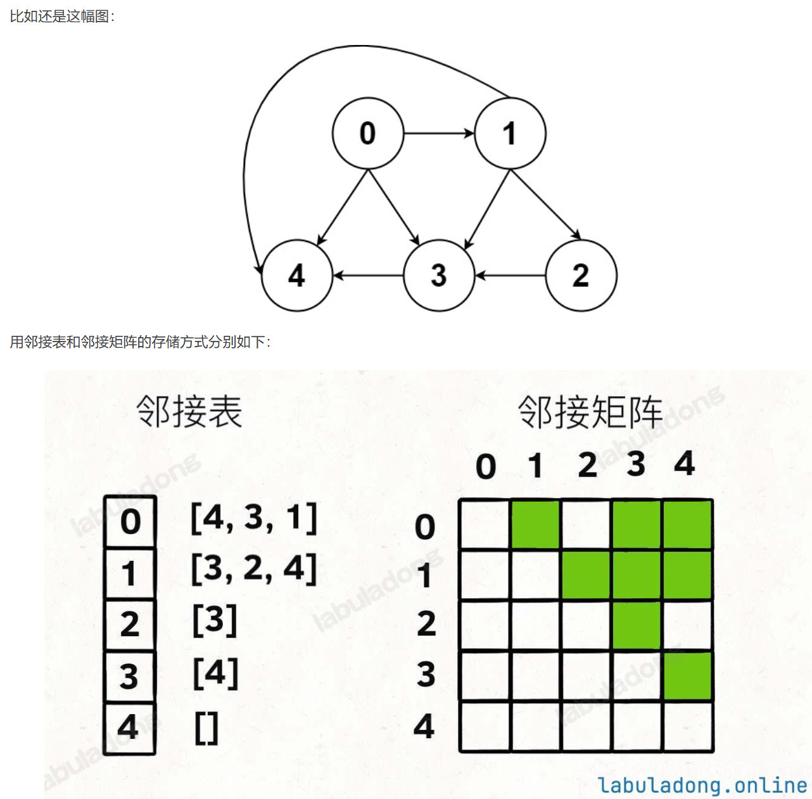

# 图论中的基本术语

## 边的方向和权重

一幅图结构由若干 **节点 (Vertex) 和 边 (Edge)** 构成，其中：

每个节点有一个唯一 ID。

**边可以是有向的**（有向图，Directional Graph），也可以是无向的（无向图，Undirected Graph）。

**边上可以有权重**（加权图，Weighted Graph），也可以没有权重（无权图，Unweighted Graph）。

因此可以衍生出：无向无权图、有向无权图、有向加权图、无向加权图

加权图在实际场景中非常常见，比如在地图 App 中，边的权重可以是两个地点之间的距离；在物流网络中，边的权重可以是两个地点之间的运输成本等等。

围绕着加权图，又会有很多经典的图论算法，比如计算最短路径，最小生成树等等。

## 度（degree）

无向图中：每个节点相连的边的条数。

有向图中：入度 (indegree，有多少条边指向他)和出度（outdegree，有多少条边指出去）。

## 子图

子图 (Subgraph)：如果图 G' 的所有节点和边都包含在图 G 中，则称 G' 是 G 的一个子图。简单来说，子图是从原图中删除一些节点和边后得到的图。

生成子图 (Spanning Subgraph)：包含原图中所有节点，但只包含部分边的子图。

导出子图 (Induced Subgraph)：选择原图的一部分节点，以及这些节点之间在原图中的所有边所构成的子图。

## 连通性
   
（1）无向图的连通性（一般主要考察无向图的连通性，而非有向图）

连通图 (Connected Graph): 如果无向图中任意两个节点之间都存在一条路径，我们称这个图是连通的。（从任意一个节点出发，都能到达其他所有节点。）

连通分量 (Connected Component)：对于非连通的无向图，其中的多个连通子图被称为连通分量，一个图可以有多个连通分量。

（2）有向图的连通性

强连通图 (Strongly Connected Graph)：如果有向图中任意两个节点之间都存在一条有向路径，我们称这个图是强连通的。

强连通分量 (Strongly Connected Component, SCC)：有向图中的若干个最大的强连通子图称为强连通分量。

弱连通图 (Weakly Connected Graph)：如果将有向图中的所有有向边都变成无向边后，该图变成连通的，那么原来的有向图就是弱连通的。

弱连通分量 (Weakly Connected Component, WCC)：将有向图的所有有向边变为无向边后，形成的连通分量称为原有向图的弱连通分量。


# 补充知识点：多叉树

## 多叉树的数据结构

每个节点有多个孩子节点（而不像二叉树只有左右两个）：

```python
class Node:
    def __init__(self, val: int):
        self.val = val
        self.children = []
```

森林就是多个多叉树的集合（单独一棵多叉树也是一个特殊的森林）

## 多叉树的递归遍历（DFS）

```python
def traverse_n_ary_tree(root):
    if root is None:
        return
    for child in root.children:
        traverse_n_ary_tree(child)
```

## 多叉树的层序遍历（BFS）

仍然需要deque实现

写法一：记录节点深度

```python
from collections import deque

def levelOrderTraverse(root):
    if root is None:
        return
    q = deque()
    q.append(root)
    # 记录当前遍历到的层数（根节点视为第 1 层）
    depth = 1

    while q:
        sz = len(q)
        for i in range(sz):
            cur = q.popleft()
            # 访问 cur 节点，同时知道它所在的层数
            print(f"depth = {depth}, val = {cur.val}")

            for child in cur.children:
                q.append(child)
        depth += 1
```

写法二：记录边的权重

```python
# 多叉树的层序遍历
# 每个节点自行维护 State 类，记录深度等信息
class State:
    def __init__(self, node, depth):
        self.node = node
        self.depth = depth

def levelOrderTraverse(root):
    if root is None:
        return
    q = deque()
    # 记录当前遍历到的层数（根节点视为第 1 层）
    q.append(State(root, 1))

    while q:
        state = q.popleft()
        cur = state.node
        depth = state.depth
        # 访问 cur 节点，同时知道它所在的层数
        print(f"depth = {depth}, val = {cur.val}")

        for child in cur.children:
            q.append(State(child, depth + 1))
```


# 图结构的通用代码实现

## 图节点的逻辑结构

其实就是类似多叉树，需要记录节点ID和他的邻居（对应多叉树的children）：

```python
class Vertex:
    def __init__(self, id: int):
        self.id = id
        self.neighbors = []
```

## 邻接表和邻接矩阵实现图结构



邻接表很直观，我把每个节点 x 的邻居都存到一个列表里，然后把 x 和这个列表映射起来，这样就可以通过一个节点 x 找到它的所有相邻节点。

邻接矩阵则是一个二维布尔数组，我们权且称为 matrix，如果节点 x 和 y 是相连的，那么就把 matrix[x][y] 设为 true（上图中绿色的方格代表 true）。如果想找节点 x 的邻居，去扫一圈 matrix[x][..] 就行了。

``` python
# 邻接表
# graph[x] 存储 x 的所有邻居节点
graph: List[List[int]] = []

# 邻接矩阵
# matrix[x][y] 记录 x 是否有一条指向 y 的边
matrix: List[List[bool]] = []
```

注意分析两种存储方式的空间复杂度，对于一幅有 V 个节点，E 条边的图，邻接表的空间复杂度是 O(V+E)，而邻接矩阵的空间复杂度是 O(V^2)

所以如果一幅图的 E 远小于 V^2（稀疏图），那么邻接表会比邻接矩阵节省空间，反之，如果 E 接近 V^2（稠密图），二者就差不多了。

在后面的图算法和习题中，大多都是稀疏图，所以你会看到**邻接表**的使用更多一些。

## 有向加权图

邻接表实现：

``` python
# 加权有向图的通用实现（邻接表）
class WeightedDigraph:
    
    # 存储相邻节点及边的权重
    class Edge:
        def __init__(self, to: int, weight: int):
            self.to = to
            self.weight = weight

    def __init__(self, n: int):
        # 我们这里简单起见，建图时要传入节点总数，这其实可以优化
        # 比如把 graph 设置为 Map<Integer, List<Edge>>，就可以动态添加新节点了
        self.graph = [[] for _ in range(n)]

    # 增，添加一条带权重的有向边，复杂度 O(1)
    def addEdge(self, from_: int, to: int, weight: int):
        self.graph[from_].append(self.Edge(to, weight))

    # 删，删除一条有向边，复杂度 O(V)
    def removeEdge(self, from_: int, to: int):
        self.graph[from_] = [e for e in self.graph[from_] if e.to != to]

    # 查，判断两个节点是否相邻，复杂度 O(V)
    def hasEdge(self, from_: int, to: int) -> bool:
        for e in self.graph[from_]:
            if e.to == to:
                return True
        return False

    # 查，返回一条边的权重，复杂度 O(V)
    def weight(self, from_: int, to: int) -> int:
        for e in self.graph[from_]:
            if e.to == to:
                return e.weight
        raise ValueError("No such edge")
    
    # 上面的 hasEdge、removeEdge、weight 方法遍历 List 的行为是可以优化的
    # 比如用 Map<Integer, Map<Integer, Integer>> 存储邻接表
    # 这样就可以避免遍历 List，复杂度就能降到 O(1)

    # 查，返回某个节点的所有邻居节点，复杂度 O(1)
    def neighbors(self, v: int):
        return self.graph[v]

if __name__ == "__main__":
    graph = WeightedDigraph(3)
    graph.addEdge(0, 1, 1)
    graph.addEdge(1, 2, 2)
    graph.addEdge(2, 0, 3)
    graph.addEdge(2, 1, 4)

    print(graph.hasEdge(0, 1))  # true
    print(graph.hasEdge(1, 0))  # false

    for edge in graph.neighbors(2):
        print(f"{2} -> {edge.to}, weight: {edge.weight}")
    # 2 -> 0, weight: 3
    # 2 -> 1, weight: 4

    graph.removeEdge(0, 1)
    print(graph.hasEdge(0, 1))  # false
```


邻接矩阵实现：

```python
class WeightedDigraph:
    # 存储相邻节点及边的权重
    class Edge:
        def __init__(self, to, weight):
            self.to = to
            self.weight = weight

    def __init__(self, n):
        # 邻接矩阵，matrix[from][to] 存储从节点 from 到节点 to 的边的权重
        # 0 表示没有连接
        self.matrix = [[0] * n for _ in range(n)]

    # 增，添加一条带权重的有向边，复杂度 O(1)
    def addEdge(self, from_node, to, weight):
        self.matrix[from_node][to] = weight

    # 删，删除一条有向边，复杂度 O(1)
    def removeEdge(self, from_node, to):
        self.matrix[from_node][to] = 0

    # 查，判断两个节点是否相邻，复杂度 O(1)
    def hasEdge(self, from_node, to):
        return self.matrix[from_node][to] != 0

    # 查，返回一条边的权重，复杂度 O(1)
    def weight(self, from_node, to):
        return self.matrix[from_node][to]

    # 查，返回某个节点的所有邻居节点，复杂度 O(V)
    def neighbors(self, v):
        res = []
        for i in range(len(self.matrix[v])):
            if self.matrix[v][i] != 0:
                res.append(self.Edge(i, self.matrix[v][i]))
        return res

if __name__ == "__main__":
    graph = WeightedDigraph(3)
    graph.addEdge(0, 1, 1)
    graph.addEdge(1, 2, 2)
    graph.addEdge(2, 0, 3)
    graph.addEdge(2, 1, 4)

    print(graph.hasEdge(0, 1)) # True
    print(graph.hasEdge(1, 0)) # False

    for edge in graph.neighbors(2):
        print(f"{2} -> {edge.to}, weight: {edge.weight}")
    # 2 -> 0, weight: 3
    # 2 -> 1, weight: 4

    graph.removeEdge(0, 1)
    print(graph.hasEdge(0, 1)) # False
```

## 有向无权图

直接复用上面的 WeightedDigraph 类就行，把 addEdge 方法的权重参数默认设置为 1 就行了。


## 无向加权图

```python
# 无向加权图的通用实现
class WeightedUndigraph:
    def __init__(self, n):
        self.graph = WeightedDigraph(n)

    # 增，添加一条带权重的无向边
    def addEdge(self, frm, to, weight):
        self.graph.addEdge(frm, to, weight)
        self.graph.addEdge(to, frm, weight)

    # 删，删除一条无向边
    def removeEdge(self, frm, to):
        self.graph.removeEdge(frm, to)
        self.graph.removeEdge(to, frm)

    # 查，判断两个节点是否相邻
    def hasEdge(self, frm, to):
        return self.graph.hasEdge(frm, to)

    # 查，返回一条边的权重
    def weight(self, frm, to):
        return self.graph.weight(frm, to)

    # 查，返回某个节点的所有邻居节点
    def neighbors(self, v):
        return self.graph.neighbors(v)

if __name__ == "__main__":
    graph = WeightedUndigraph(3)
    graph.addEdge(0, 1, 1)
    graph.addEdge(2, 0, 3)
    graph.addEdge(2, 1, 4)

    print(graph.hasEdge(0, 1))  # true
    print(graph.hasEdge(1, 0))  # true

    for edge in graph.neighbors(2):
        print(f"{2} <-> {edge.to}, weight: {edge.weight}")
    # 2 <-> 0, weight: 3
    # 2 <-> 1, weight: 4

    graph.removeEdge(0, 1)
    print(graph.hasEdge(0, 1))  # false
    print(graph.hasEdge(1, 0))  # false
```

## 无向无权图

直接复用上面的 WeightedUndigraph 类就行，把 addEdge 方法的权重参数默认设置为 1 就行了。
