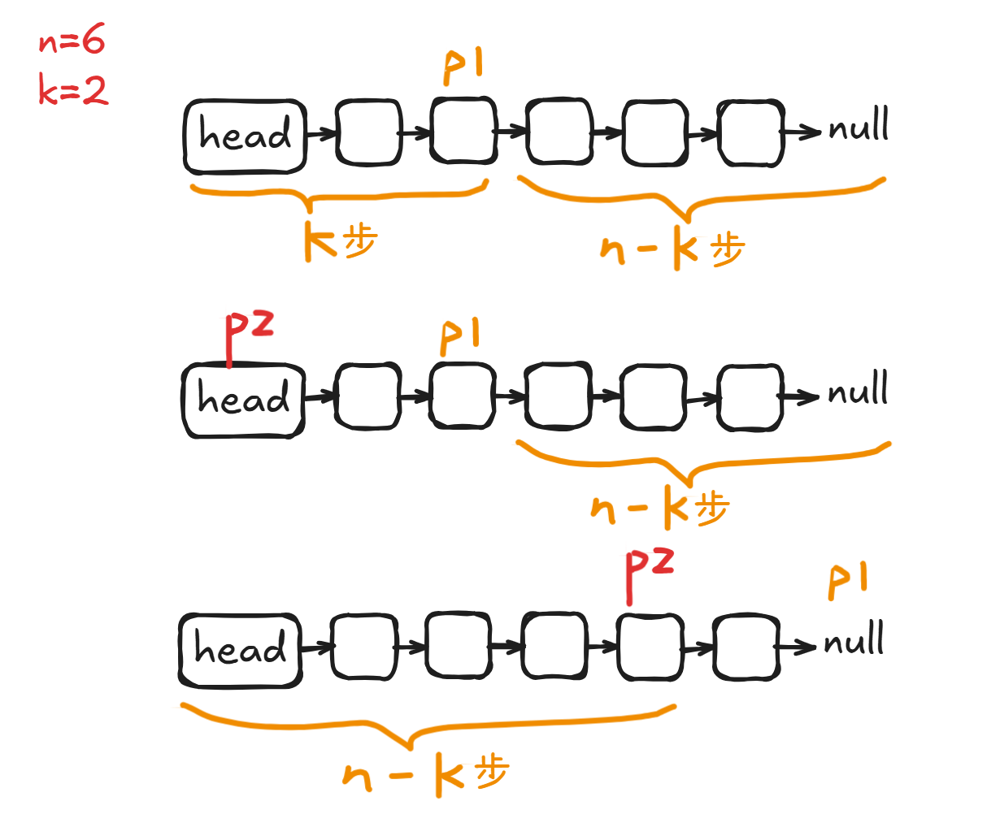

# Problem
https://labuladong.online/zh/problem/leetcode/remove-nth-node-from-end-of-list/description/


# Problem Description
给你一个链表，删除链表的倒数第 n 个结点，并且返回链表的头结点。

数据范围：

链表中结点的数目为 sz

1 <= sz <= 30

0 <= Node.val <= 100

1 <= n <= sz

给你一个链表的头结点 head 和一个整数 n，删除链表的倒数第 n 个结点，并返回删除后的链表头结点。


# Key Points
步骤：找到链表的倒数第N个节点 -> 删除链表中间节点

问题：如何找到单链表的倒数第K个节点？

假设链表有 n 个节点，倒数第 k 个节点就是正数第 n - k + 1 个节点，问题是链表需要遍历一遍 O(n) 才能求出 n，然后再遍历得到 n - k + 1

那么，我们能不能只遍历一次链表，就算出倒数第 k 个节点？假设 k = 2，思路如下：

1. 让指针 p1 指向 head，走 k 步
2. 现在的 p1，只要再走 n - k 步，就能走到链表末尾的空指针。此时，再用一个指针 p2 指向链表头节点 head；让 p1 和 p2 同时向前走，p1 走到链表末尾的空指针时前进了 n - k 步，p2 也从 head 开始前进了 n - k 步，停留在第 n - k + 1 个节点上，即恰好停链表的倒数第 k 个节点上
3. 这样，只遍历了一次链表，就获得了倒数第 k 个节点 p2。
   


代码实现如下：

```python
# 寻找链表的倒数第k个节点
def findLastK(self, head: Optional[ListNode], k) -> Optional[ListNode]:
  # p1先走k步
  p1 = head 
  for i in range(0, k):
    p1 = p1.next
    # 这个时候p2从head出发
    p2 = head
  # p2和p1都走n-k步（因为未知完整长度n，写代码不能写n），p1走到none
  while p1 is not None:
    p2 = p2.next
    p1 = p1.next
    # 此时p2的位置就是倒数第k个节点
    return p2
```

# Code

## LC version

```python
class Solution:
    def removeNthFromEnd(self, head: Optional[ListNode], n: int) -> Optional[ListNode]:
        dummy = ListNode(-1) # 要建立虚拟头结点，处理删除头节点的情况
        dummy.next = head
        p = self.findLastK(dummy, n + 1) # 要删除结点的前一个节点
        p.next = p.next.next
        return dummy.next

    # 寻找链表的倒数第k个节点
    def findLastK(self, head: Optional[ListNode], k) -> Optional[ListNode]:
        # p1先走k步
        p1 = head 
        for i in range(0, k):
            p1 = p1.next
        # 这个时候p2从head出发
        p2 = head
        # p2和p1都走n-k步（因为未知完整长度n，写代码不能写n），p1走到none
        while p1 is not None:
            p2 = p2.next
            p1 = p1.next
        # 此时p2的位置就是倒数第k个节点
        return p2
```


# Complexity Analysis
- 时间复杂度：O(n)
- 空间复杂度：O(n)
