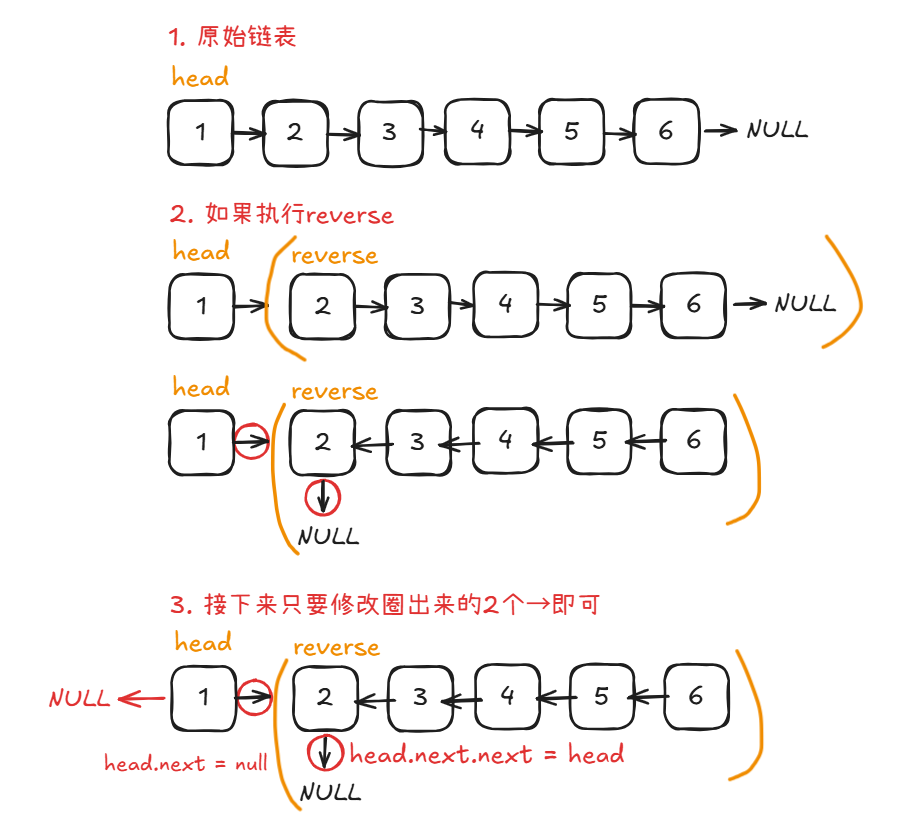

# Problem
https://labuladong.online/zh/problem/leetcode/reverse-linked-list/description/


# Problem Description
给你单链表的头节点 head，请你反转链表，并返回反转后的链表。

数据范围：

链表中节点的数目范围是 [0, 5000]

-5000 <= Node.val <= 5000

给你单链表的头节点 head，请你反转链表，并返回反转后的链表。


# Key Points
第一想法是用左右指针不断交换值，问题1：链表不像数组，需要先遍历一次才能到达tail，然后还要遍历一次不断交换，能不能只遍历一次得到答案？

问题2：如何保证left在right左侧，listnode这个type不好判断

遂放弃，使用**递归**，首先明确递归函数定义：对于reverse(head),输入一个节点 head，将「以 head 为起点」的链表反转，并返回反转之后的头结点。




# Code

## LC version

```python
class Solution:
    def reverseList(self, head: Optional[ListNode]) -> Optional[ListNode]:
        # 如果为空或者只有一个元素
        if head is None or head.next is None:
            return head

        last = self.reverseList(head.next) # 不断向下递归
        head.next.next = head
        head.next = None
        return last
```


# Complexity Analysis
- 时间复杂度：O(n)
- 空间复杂度：O(n)
