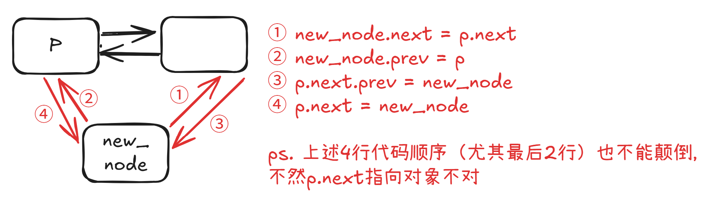

# 存储原理
数组（顺序存储）：一块连续的内存空间，有了这块内存空间的首地址，就能直接通过索引计算出任意位置的元素地址。

链表不一样，一条链表并不需要一整块连续的内存空间存储元素。链表的元素可以分散在内存空间的天涯海角，通过每个节点上的 next, prev 指针，将零散的内存块串联起来形成一个链式结构。

# 单链表
创建单链表
```python
class ListNode:
    def __init__(self, x):
        self.val = x
        self.next = None

# 输入一个数组，转换为一条单链表
def createLinkedList(arr: 'List[int]') -> 'ListNode':
    if arr is None or len(arr) == 0:
        return None

    head = ListNode(arr[0])
    cur = head
    for i in range(1, len(arr)):
        cur.next = ListNode(arr[i])
        cur = cur.next

    return head
```

查/改：访问单链表的每一个节点，并打印其值，最坏的时间复杂度O(n)
```python
# 创建一条单链表
head = createLinkedList([1, 2, 3, 4, 5])

# 遍历单链表
p = head
while p is not None:
    print(p.val)
    p = p.next
```

增
1. 在链表头部插入节点，时间复杂度O(1)
```python
# 创建一条单链表
head = createLinkedList([1, 2, 3, 4, 5])

# 在单链表头部插入一个新节点 0
newNode = ListNode(0)
newNode.next = head
head = newNode # 注意加上这一行，因为插入的节点才是头结点了

# 现在链表变成了 0 -> 1 -> 2 -> 3 -> 4 -> 5
```

2. 在单链表尾部插入新元素，时间复杂度O(n)
```python
# 创建一条单链表
head = createLinkedList([1, 2, 3, 4, 5])

# 在单链表尾部插入一个新节点 6
p = head
# 先走到链表的最后一个节点
while p.next is not None:
    p = p.next
# 现在 p 就是链表的最后一个节点在 p 后面插入新节点
p.next = ListNode(6)

# 现在链表变成了 1 -> 2 -> 3 -> 4 -> 5 -> 6
```

3. 在单链表中间插入新元素，时间复杂度O(n)——注意是先new_node.next = p.next，不然不知道原来p的下一个节点
```python
# 创建一条单链表
head = createLinkedList([1, 2, 3, 4, 5])

# 在第 3 个节点后面插入一个新节点 66
# 先要找到前驱节点，即第 3 个节点
p = head
for _ in range(2):
    p = p.next
# 此时 p 指向第 3 个节点，组装新节点的后驱指针
new_node = ListNode(66)
new_node.next = p.next

# 插入新节点
p.next = new_node

# 现在链表变成了 1 -> 2 -> 3 -> 66 -> 4 -> 5
```

删
1. 在单链表中删除一个节点，时间复杂度O(n)
```python
# 创建一条单链表
head = createLinkedList([1, 2, 3, 4, 5])

# 删除第 4 个节点，要操作前驱节点
p = head
for i in range(2):
    p = p.next

# 此时 p 指向第 3 个节点，即要删除节点的前驱节点
# 把第 4 个节点从链表中摘除
p.next = p.next.next

# 现在链表变成了 1 -> 2 -> 3 -> 5
```

2. 删除头结点，时间复杂度O(1)
```python
# 创建一条单链表
head = createLinkedList([1, 2, 3, 4, 5])

# 删除头结点
head = head.next

# 现在链表变成了 2 -> 3 -> 4 -> 5
```

3. 删除尾节点，时间复杂度O(n)
```python
# 创建一条单链表
head = createLinkedList([1, 2, 3, 4, 5])

# 删除尾节点
p = head
# 找到倒数第二个节点
while p.next.next is not None:
    p = p.next

# 此时 p 指向倒数第二个节点
# 把尾节点从链表中摘除
p.next = None

# 现在链表变成了 1 -> 2 -> 3 -> 4
```

PS. 最重要的，我们会使用**虚拟头结点**技巧，**把头、尾、中部的操作统一起来，同时还能避免处理头尾指针为空情况的边界情况**。


# 双链表
创建双链表
```python
class DoublyListNode:
    def __init__(self, x):
        self.val = x
        self.next = None
        self.prev = None
        
def createDoublyLinkedList(arr: List[int]) -> Optional[DoublyListNode]:
    if not arr:
        return None
    
    head = DoublyListNode(arr[0])
    cur = head
    
    # for 循环迭代创建双链表
    for val in arr[1:]:
        new_node = DoublyListNode(val)
        cur.next = new_node
        new_node.prev = cur
        cur = cur.next
    
    return head
```


查/改，时间复杂度为O(n)
```python
# 创建一条双链表
head = createDoublyLinkedList([1, 2, 3, 4, 5])
tail = None # 创建的是尾结点

# 从头节点向后遍历双链表
p = head
while p:
    print(p.val)
    tail = p
    p = p.next

# 从尾节点向前遍历双链表
p = tail
while p:
    print(p.val)
    p = p.prev
```

增

1. 在双链表头部插入新元素，时间复杂度O(1)
```python
// 创建一条双链表
DoublyListNode head = createDoublyLinkedList(new int[]{1, 2, 3, 4, 5});

// 在双链表头部插入新节点 0
DoublyListNode newHead = new DoublyListNode(0);
newHead.next = head;
head.prev = newHead;
head = newHead;
// 现在链表变成了 0 -> 1 -> 2 -> 3 -> 4 -> 5
```

2. 在双链表尾部插入新元素，时间复杂度O(n)
```python
# 创建一条双链表
head = createDoublyLinkedList([1, 2, 3, 4, 5])

tail = head
# 先走到链表的最后一个节点
while tail.next is not None:
    tail = tail.next

# 在双链表尾部插入新节点 6
newNode = DoublyListNode(6)
tail.next = newNode
newNode.prev = tail
# 更新尾节点引用
tail = newNode

# 现在链表变成了 1 -> 2 -> 3 -> 4 -> 5 -> 6

// 现在链表变成了 1 -> 2 -> 3 -> 4 -> 5 -> 6
```

3. 在双链表中间插入新元素，时间复杂度O(n)

```python
# 创建一条双链表
head = createDoublyLinkedList([1, 2, 3, 4, 5])

# 想要插入到索引 3（第 4 个节点）
# 需要操作索引 2（第 3 个节点）的指针
p = head
for _ in range(2):
    p = p.next

# 组装新节点
newNode = DoublyListNode(66)

# 特别强调下面四行代码的顺序
newNode.next = p.next
newNode.prev = p
p.next.prev = newNode
p.next = newNode

# 现在链表变成了 1 -> 2 -> 3 -> 66 -> 4 -> 5
```

删

1. 在双链表中删除一个节点，时间复杂度O(n)
```python
# 创建一条双链表
head = createDoublyLinkedList([1, 2, 3, 4, 5])

# 删除第 4 个节点
# 先找到第 3 个节点
p = head
for i in range(2):
    p = p.next

# 现在 p 指向第 3 个节点，我们将它后面的那个节点摘除出去
toDelete = p.next

# 把 toDelete 从链表中摘除
p.next = toDelete.next
toDelete.next.prev = p

# 把 toDelete 的前后指针都置为 null 是个好习惯（可选）
toDelete.next = None
toDelete.prev = None

# 现在链表变成了 1 -> 2 -> 3 -> 5
```

2. 在双链表头部删除元素，时间复杂度O(1)
```python
# 创建一条双链表
head = createDoublyLinkedList([1, 2, 3, 4, 5])

# 删除头结点
toDelete = head
head = head.next
head.prev = None

# 清理已删除节点的指针
toDelete.next = None

# 现在链表变成了 2 -> 3 -> 4 -> 5
```

3. 在双链表尾部删除元素，时间复杂度O(n)
```python
# 创建一条双链表
head = createDoublyLinkedList([1, 2, 3, 4, 5])

# 删除尾节点
p = head
# 找到尾结点
while p.next is not None:
    p = p.next

# 现在 p 指向尾节点
# 把尾节点从链表中摘除
p.prev.next = None

# 把被删结点的指针都断开是个好习惯（可选）
p.prev = None

# 现在链表变成了 1 -> 2 -> 3 -> 4
```
