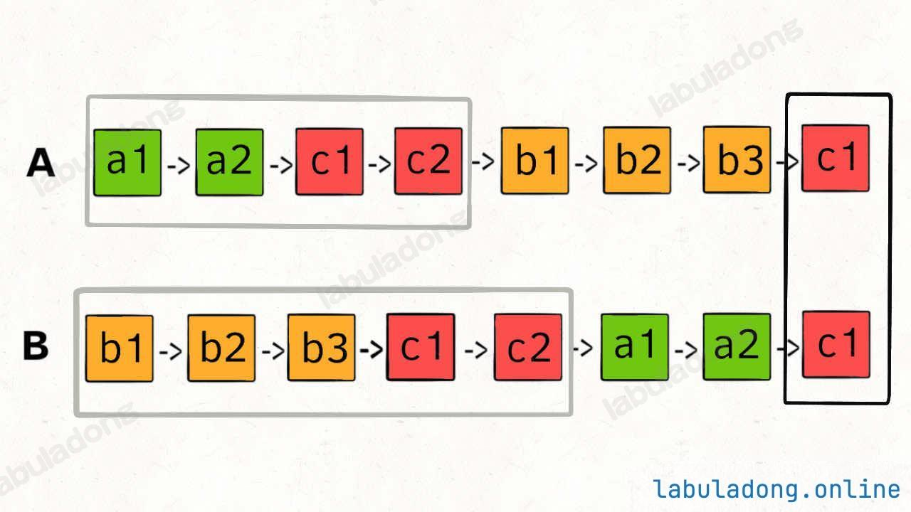

# Problem
https://labuladong.online/zh/problem/leetcode/intersection-of-two-linked-lists/description/


# Problem Description
给定两个单链表的头节点 headA 和 headB，请你找出并返回两个单链表相交的起始节点。如果两个链表不存在相交节点，返回 null。

题目数据保证整个链状结构中不存在环。**函数返回结果后，链表必须保持其原始结构。**

# Key Points
链表不一样长，如果使用两个指针分别遍历，无法遇到相交点

解决这个问题的关键是，通过某些方式，让 p1 和 p2 能够同时到达相交节点 c1。

所以，我们可以让 p1 遍历完链表 A 之后开始遍历链表 B，让 p2 遍历完链表 B 之后开始遍历链表 A，这样相当于「逻辑上」两条链表接在了一起。

如果这样进行拼接，就可以让 p1 和 p2 同时进入公共部分，也就是同时到达相交节点 c1：



那你可能会问，如果说两个链表没有相交点，是否能够正确的返回 null 呢？

这个逻辑可以覆盖这种情况的，相当于 c1 节点是 null 空指针嘛，可以正确返回 null。

# Code

## LC version

```python
class Solution:
    def getIntersectionNode(self, headA: Optional[ListNode], headB: Optional[ListNode]) -> Optional[ListNode]:
        p1 = headA
        p2 = headB
        while p1 != p2: # 关键点是让两个指针相遇
            p1 = headB if p1 is None else p1.next
            p2 = headA if p2 is None else p2.next
        return p1
```


# Complexity Analysis
- 时间复杂度：O(n)
- 空间复杂度：O(1)
