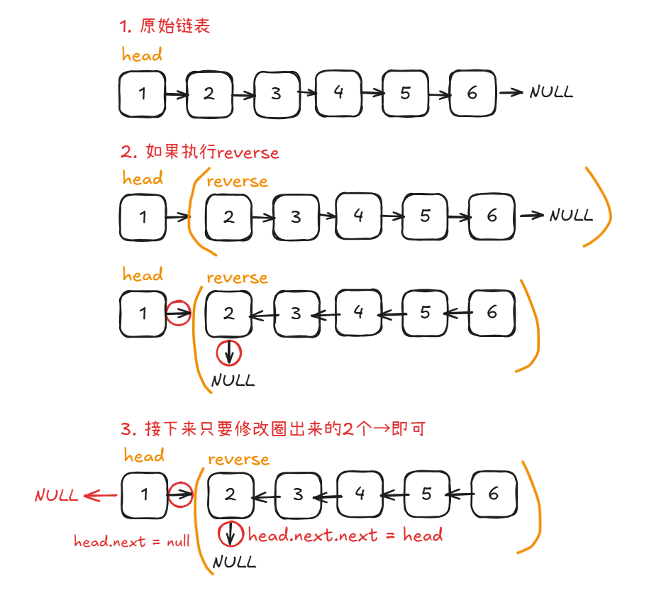

# Problem
https://labuladong.online/zh/problem/leetcode/reverse-linked-list/description/


# Problem Description
给你单链表的头节点 head，请你反转链表，并返回反转后的链表。

数据范围：

链表中节点的数目范围是 [0, 5000]

-5000 <= Node.val <= 5000

给你单链表的头节点 head，请你反转链表，并返回反转后的链表。


# Key Points
**考虑问题能否用递归解决：这个问题是否存在子问题结构？**

**采用分治思想：通过递归函数的定义，把原问题分解成若干规模更小、结构相同的子问题，最后通过子问题的答案组装原问题的解。**

假对于链表1->2->3->4，如果我忽略这个头结点 1，只拿出 2->3->4 这个子链表，它也是个单链表对吧？

那么你这个 reverseList 函数，只要输入一个单链表，就能给我反转对吧？那么你能不能用这个函数先来反转 2->3->4 这个子链表呢，然后再想办法把 1 接到反转后的 4->3->2 的最后面，是不是就完成了整个链表的反转？确实存在子问题结构！




# Code

## ACM version

```python
import sys 

class ListNode:
    def __init__(self, val = 0, next = None):
        self.val = val
        self.next = next

class Solution:
    def reverseList(self, head):
        # 假设对于1->2->3->4，先反转2->3->4，然后在那(2)之后接上1即可
        if head is None or head.next is None: # 0/1个元素，没有反转的必要
            return head
        second = self.reverseList(head.next)
        head.next.next = head
        head.next = None
        return second # 从4开头

def build_list(array):
    dummy = ListNode(-1)
    p = dummy
    for num in array:
        p.next = ListNode(num)
        p = p.next
    return dummy.next
    
def print_list(head):
    vals = []
    p = head
    while p:
        vals.append(str(p.val))
        p = p.next
    return (len(vals), " ".join(vals))

def main():
    data = sys.stdin.read().strip().split("\n")
    idx = 0
    while idx < len(data):
        parts = data[idx].split()
        n = int(parts[0]) # 链表长度
        array = list(map(int, parts[1: 1 + n]))
        head = build_list(array)
        ans = Solution().reverseList(head)
        length, s = print_list(ans)
        print(length, s)
        idx += 1

if __name__ == "__main__":
    main()
```


# Complexity Analysis
- 时间复杂度：O(n)
- 空间复杂度：O(n)
