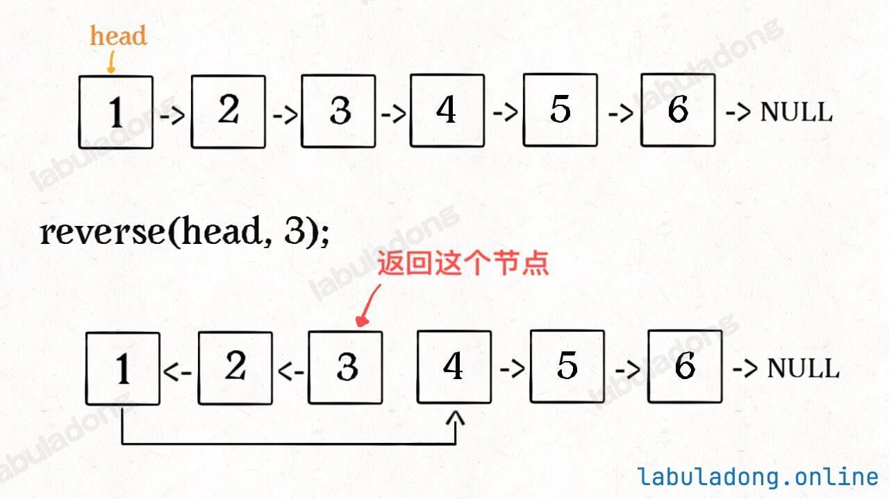

# 补充问题：反转链表的前N个节点



比如1-2-3-4-5-6，反转前3个节点得到3-2-1-4-5-6

**依然采用递归的思想：需要反转前N个节点，也就是反转head后面的N-1个节点、原来的head.next指向head，然后head.next=N+1个节点**

```python
# 从 head 这个节点开始，反转连续的 n 个节点
# n 可以理解为"从当前 head 开始，还剩几个节点要反转"
class Solution:
    def __init__(self):
        self.successor = None # 记录第N+1个节点

    def reverseN(self, head, n):
        # base case
        if n == 1: # 当前 head 就是这一整段要反转的最后一个节点，也就是第 N 个节点
            self.successor = head.next # 那么第N+1节点（用successor记录）就是head.next
            return head
        new_head = self.reverseN(head, n - 1)
        head.next.next = head
        head.next = self.successor
        return new_head
```

PS:为什么base case：if n == 1: # 当前 head 就是这一整段要反转的最后一个节点，也就是第 N 个节点
```python
head=1, n=3:   [1  2  3]  4  5     ← 要反转 1,2,3
head=2, n=2:    1 [2  3] 4  5      ← 要反转 2,3
head=3, n=1:    1  2 [3] 4  5      ← 要反转 3（就它一个，它是最后一个）

n 可以理解为"从当前 head 开始，还剩几个节点要反转"：
head 在第 1 个时，剩 N 个要反转 → n = N
head 在第 2 个时，剩 N-1 个要反转 → n = N-1
…
head 在第 N 个时，剩 1 个要反转 → n = 1
"还剩 1 个要反转"意味着 head 就是最后一个。
```

PS: 什么是base case

base case（基本情况 / 递归出口） 就是递归不再往下调用自己的那一步，直接返回结果。递归函数必须有 base case，否则会无限调用下去，直到栈溢出。它回答的问题是："什么时候这个问题已经小到不用再递归了？"

# Problem
https://leetcode.cn/problems/reverse-linked-list-ii/description/


# Problem Description

给你单链表的头指针 head 和两个整数 left 和 right ，其中 left <= right 。请你反转从位置 left 到位置 right 的链表节点，返回 反转后的链表 。


# Code

## LC version

```python
# 递归：反转从left开始的right-left+1个节点，复用reverseN即可，问题在于如何找到left？
class Solution:
    def __init__(self):
        self.successor = None

    def reverseBetween(self, head: Optional[ListNode], left: int, right: int) -> Optional[ListNode]:
        dummy = ListNode(-1) # 处理left-1情况
        dummy.next = head
        p = dummy
        for _ in range(left - 1): # p为left-1节点
            p = p.next
        second = self.reverseN(p.next, right - left + 1)
        p.next = second
        return dummy.next
    
    # 反转从head开始的n个节点
    def reverseN(self, head, n):
        if n == 1:
            self.successor = head.next
            return head
        new_head = self.reverseN(head.next, n -1)
        head.next.next = head
        head.next = self.successor
        return new_head
```
