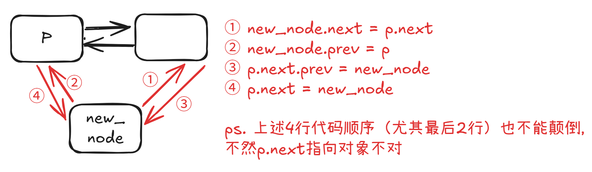

# 存储原理
**数组**用一块连续内存存储元素，知道首地址后可通过索引直接计算任意元素地址，因此支持随机访问，**查询**效率高（O(1)）；但插入、删除通常需要搬移后续元素，平均为 O(1) 到 O(n)，且扩容可能带来额外开销。

**链表**不要求连续内存，节点通过 next / prev 指针串联，因此**插入、删除**只需修改指针，若已定位到前驱或后继节点，时间复杂度为 O(1)，也不存在数组式扩容问题；但无法根据索引直接计算地址，所以不支持随机访问，查找需要从头遍历，平均为 O(n)，同时每个节点还要额外存储指针，空间开销更大。

在 LeetCode 中可这样选择：
- 频繁按索引随机访问、查询多、增删少：优先用数组。
- 频繁在已知位置插入、删除，尤其是头部或中间操作多：优先用链表。
- 需要大量查找且数据动态变化：可考虑哈希表；需要有序查找：可考虑平衡树等结构。
- 若既想随机访问又想高效增删，可结合数组 + 哈希表、双向链表 + 哈希表（如 LRU）等组合结构。

总结：数组擅长“随机访问、查改多”，链表擅长“已知位置增删多”；选择时看操作频率、是否需要索引访问，以及空间是否敏感。


# 什么时候使用虚拟头节点dummy

```python
dummy = ListNode(-1)
dummy.next = head
p = dummy
# 最后return dummy.next
```

需要创建新链表的时候——**结果链表的头结点在开始时无法确定，或者需要对空链表做特殊处理时**，就用 dummy。

几个常见信号：需要**在头部插入节点（头会变）、需要合并/拆分链表、需要删除节点（待删节点可能就是头结点、用 dummy 可以让删除逻辑统一）**、任何你会写出 if (head == null) 来特判的地方

反过来，如果只是遍历一条已存在的链表、头结点始终不变，那就没必要用 dummy。


# 链表ACM模式怎么写

```python
import sys

# 1. 链表节点类
class ListNode:
    def __init__(self, val: int = 0, next = None):
        self.val = val
        self.next = next

# 2. 核心函数类
class Solution:
    def xx(self):
        pass

# 3. 数组->链表
def build_list(arr):
    dummy = ListNode(-1)
    p = dummy
    for x in arr:
        p.next = ListNode(x)
        p = p.next
    return dummy.next

# 4. 链表->数组（一般需要print长度+内容，形如5 1 2 3 4 5）
def print_list(head):
    vals = []
    p = head
    while p:
        vals.append(str(p.val))
        p = p.next
    print(len(vals), " ".join(vals)) # 注意这里就写好print而非return，这样main函数不用纠结return还是print，直接return

# 5. 主函数以及其执行
def main():
    data = sys.stdin.read().strip().split('\n')
    idx = 0
    while idx / idx + 1 < len(data): # 取决于一行行读，还是输入必须要2行才能处理问题
        parts = data[idx].split(); idx += 1
        len = int(parts[0])
        array = list(map(int, parts[1: 1 + len]))
        list = build_list(array)
        ans = Solution().xx()
        print_list(ans)

if __name__ == "__main__":
    main()
```

# 链表题型总结

一般使用双指针或者递归就能解决链表问题

## 双指针
- 快慢指针：寻找/删除链表倒数第N个节点+环形链表问题+相交链表，通过双指针走路步幅的差距可以推出答案
- 两数相加+两数相加II：处理进位问题，total和carry分别是//10还是%10
- 合并2个有序链表：要用到dummy（新建链表），然后不断比l1和l2节点大小加入即可/同样使用dummy的还有分隔链表、删除排序链表的重复元素
- 特殊：LRU缓存问题，数据结构使用哈希双链表，但是实际上写的时候没有用到双链表相关，collections.orderedDict()即可

## 递归

什么时候使用递归&递归问题如何思考：想这个问题是否存在子问题结构？把原问题分解成若干规模更小、结构相同的子问题，最后通过子问题的答案组装原问题的解。

例如：反转链表，对于链表1->2->3->4，只要反转head.next即2->3->4部分然后组装上1就行。**递归问题一般都是处理为2部分（而不是N部分，思考一步递归函数即可）然后拼接！**

递归问题有一个base case（递归出口）：递归不再往下调用自己的那一步，直接返回结果。递归函数必须有 base case，否则会无限调用下去，直到栈溢出。

另外，注意考虑特殊情况：链表节点个数是否满足题目要求，这个写在最开始用if判断

- 反转链表->反转链表前N个节点->反转链表中间一段
- 两两交换链表中的节点->K个一组反转链表
- 合并K个升序链表
- 类似归并：回文链表、排序链表（都分成两段看）

# 附录：基本语法
## 单链表
创建单链表
```python
class ListNode:
    def __init__(self, x):
        self.val = x
        self.next = None

# 输入一个数组，转换为一条单链表
def createLinkedList(arr: 'List[int]') -> 'ListNode':
    if arr is None or len(arr) == 0:
        return None

    head = ListNode(arr[0])
    cur = head
    for i in range(1, len(arr)):
        cur.next = ListNode(arr[i])
        cur = cur.next

    return head
```

查/改：访问单链表的每一个节点，并打印其值，最坏的时间复杂度O(n)
```python
# 创建一条单链表
head = createLinkedList([1, 2, 3, 4, 5])

# 遍历单链表
p = head
while p is not None:
    print(p.val)
    p = p.next
```

增
1. 在链表头部插入节点，时间复杂度O(1)
```python
# 创建一条单链表
head = createLinkedList([1, 2, 3, 4, 5])

# 在单链表头部插入一个新节点 0
newNode = ListNode(0)
newNode.next = head
head = newNode # 注意加上这一行，因为插入的节点才是头结点了

# 现在链表变成了 0 -> 1 -> 2 -> 3 -> 4 -> 5
```

2. 在单链表尾部插入新元素，时间复杂度O(n)
```python
# 创建一条单链表
head = createLinkedList([1, 2, 3, 4, 5])

# 在单链表尾部插入一个新节点 6
p = head
# 先走到链表的最后一个节点
while p.next is not None:
    p = p.next
# 现在 p 就是链表的最后一个节点在 p 后面插入新节点
p.next = ListNode(6)

# 现在链表变成了 1 -> 2 -> 3 -> 4 -> 5 -> 6
```

3. 在单链表中间插入新元素，时间复杂度O(n)——注意是先new_node.next = p.next，不然不知道原来p的下一个节点
```python
# 创建一条单链表
head = createLinkedList([1, 2, 3, 4, 5])

# 在第 3 个节点后面插入一个新节点 66
# 先要找到前驱节点，即第 3 个节点
p = head
for _ in range(2):
    p = p.next
# 此时 p 指向第 3 个节点，组装新节点的后驱指针
new_node = ListNode(66)
new_node.next = p.next

# 插入新节点
p.next = new_node

# 现在链表变成了 1 -> 2 -> 3 -> 66 -> 4 -> 5
```

删
1. 在单链表中删除一个节点，时间复杂度O(n)
```python
# 创建一条单链表
head = createLinkedList([1, 2, 3, 4, 5])

# 删除第 4 个节点，要操作前驱节点
p = head
for i in range(2):
    p = p.next

# 此时 p 指向第 3 个节点，即要删除节点的前驱节点
# 把第 4 个节点从链表中摘除
p.next = p.next.next

# 现在链表变成了 1 -> 2 -> 3 -> 5
```

2. 删除头结点，时间复杂度O(1)
```python
# 创建一条单链表
head = createLinkedList([1, 2, 3, 4, 5])

# 删除头结点
head = head.next

# 现在链表变成了 2 -> 3 -> 4 -> 5
```

3. 删除尾节点，时间复杂度O(n)
```python
# 创建一条单链表
head = createLinkedList([1, 2, 3, 4, 5])

# 删除尾节点
p = head
# 找到倒数第二个节点
while p.next.next is not None:
    p = p.next

# 此时 p 指向倒数第二个节点
# 把尾节点从链表中摘除
p.next = None

# 现在链表变成了 1 -> 2 -> 3 -> 4
```

PS. 最重要的，我们会使用**虚拟头结点**技巧，**把头、尾、中部的操作统一起来，同时还能避免处理头尾指针为空情况的边界情况**。


## 双链表
创建双链表
```python
class DoublyListNode:
    def __init__(self, x):
        self.val = x
        self.next = None
        self.prev = None
        
def createDoublyLinkedList(arr: List[int]) -> Optional[DoublyListNode]:
    if not arr:
        return None
    
    head = DoublyListNode(arr[0])
    cur = head
    
    # for 循环迭代创建双链表
    for val in arr[1:]:
        new_node = DoublyListNode(val)
        cur.next = new_node
        new_node.prev = cur
        cur = cur.next
    
    return head
```


查/改，时间复杂度为O(n)
```python
# 创建一条双链表
head = createDoublyLinkedList([1, 2, 3, 4, 5])
tail = None # 创建的是尾结点

# 从头节点向后遍历双链表
p = head
while p:
    print(p.val)
    tail = p
    p = p.next

# 从尾节点向前遍历双链表
p = tail
while p:
    print(p.val)
    p = p.prev
```

增

1. 在双链表头部插入新元素，时间复杂度O(1)
```python
// 创建一条双链表
DoublyListNode head = createDoublyLinkedList(new int[]{1, 2, 3, 4, 5});

// 在双链表头部插入新节点 0
DoublyListNode newHead = new DoublyListNode(0);
newHead.next = head;
head.prev = newHead;
head = newHead;
// 现在链表变成了 0 -> 1 -> 2 -> 3 -> 4 -> 5
```

2. 在双链表尾部插入新元素，时间复杂度O(n)

```python
# 创建一条双链表
head = createDoublyLinkedList([1, 2, 3, 4, 5])

tail = head
# 先走到链表的最后一个节点
while tail.next is not None:
    tail = tail.next

# 在双链表尾部插入新节点 6
newNode = DoublyListNode(6)
tail.next = newNode
newNode.prev = tail
# 更新尾节点引用
tail = newNode

# 现在链表变成了 1 -> 2 -> 3 -> 4 -> 5 -> 6

// 现在链表变成了 1 -> 2 -> 3 -> 4 -> 5 -> 6
```

3. **在双链表中间插入新元素**，时间复杂度O(n)



```python
# 创建一条双链表
head = createDoublyLinkedList([1, 2, 3, 4, 5])

# 想要插入到索引 3（第 4 个节点）
# 需要操作索引 2（第 3 个节点）的指针
p = head
for _ in range(2):
    p = p.next

# 组装新节点
newNode = DoublyListNode(66)

# 特别强调下面四行代码的顺序
newNode.next = p.next
newNode.prev = p
p.next.prev = newNode
p.next = newNode

# 现在链表变成了 1 -> 2 -> 3 -> 66 -> 4 -> 5
```

删

1. 在双链表中删除一个节点，时间复杂度O(n)
```python
# 创建一条双链表
head = createDoublyLinkedList([1, 2, 3, 4, 5])

# 删除第 4 个节点
# 先找到第 3 个节点
p = head
for i in range(2):
    p = p.next

# 现在 p 指向第 3 个节点，我们将它后面的那个节点摘除出去
toDelete = p.next

# 把 toDelete 从链表中摘除
p.next = toDelete.next
toDelete.next.prev = p

# 把 toDelete 的前后指针都置为 null 是个好习惯（可选）
toDelete.next = None
toDelete.prev = None

# 现在链表变成了 1 -> 2 -> 3 -> 5
```

2. 在双链表头部删除元素，时间复杂度O(1)
```python
# 创建一条双链表
head = createDoublyLinkedList([1, 2, 3, 4, 5])

# 删除头结点
toDelete = head
head = head.next
head.prev = None

# 清理已删除节点的指针
toDelete.next = None

# 现在链表变成了 2 -> 3 -> 4 -> 5
```

3. 在双链表尾部删除元素，时间复杂度O(n)
```python
# 创建一条双链表
head = createDoublyLinkedList([1, 2, 3, 4, 5])

# 删除尾节点
p = head
# 找到尾结点
while p.next is not None:
    p = p.next

# 现在 p 指向尾节点
# 把尾节点从链表中摘除
p.prev.next = None
```
