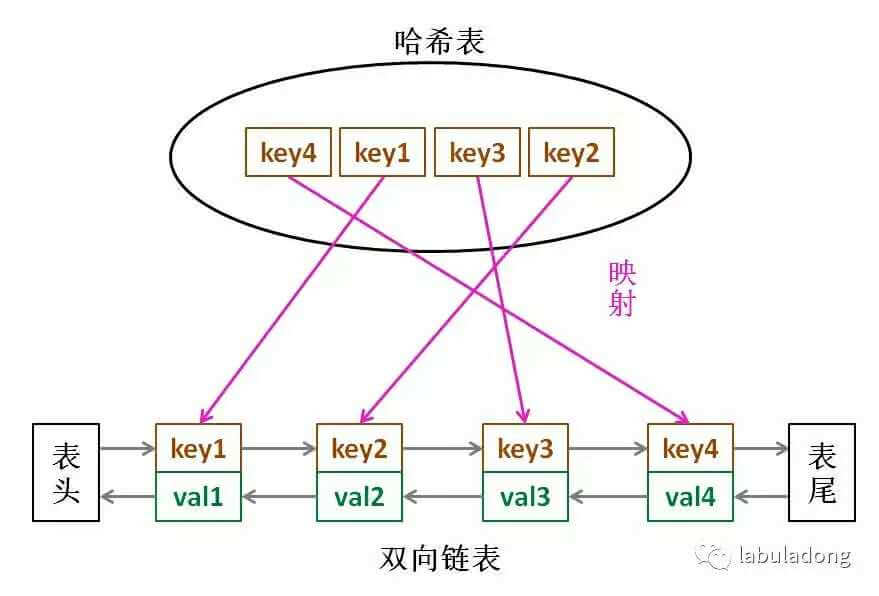
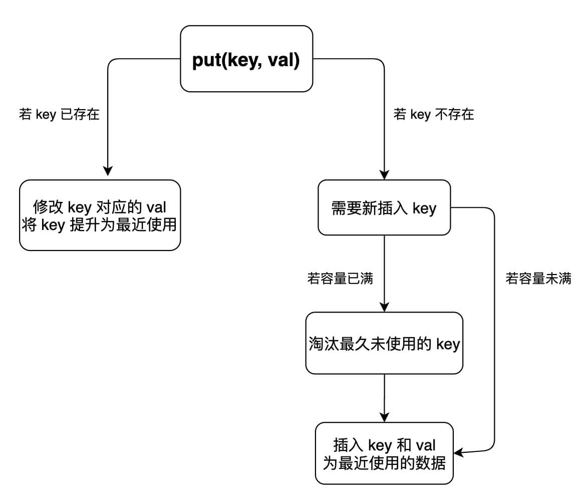

# Problem
https://labuladong.online/zh/problem/leetcode/lru-cache/description/


# Problem Description
请你设计并实现一个满足 LRU（最近最少使用）缓存约束的数据结构。

实现 LRUCache 类：

LRUCache(int capacity)：以正整数作为容量 capacity 初始化 LRU 缓存。

int get(int key)：如果关键字 key 存在于缓存中，则返回关键字的值，否则返回 -1。

void put(int key, int value)：如果关键字 key 已经存在，则变更其数据值 value；如果不存在，则向缓存中插入该组 key-value。如果插入操作导致关键字数量超过 capacity，则应该 逐出 最久未使用的关键字。

函数 get 和 put 必须以 O(1) 的平均时间复杂度运行。

核心代码模式下，你需要实现 LRUCache 类，对外提供构造函数、get 与 put 三个方法。判题端会按调用序列依次执行你实现的方法，并收集所有 get 调用的返回值。


# Key Points
LRU 是 Least Recently Used 的缩写，意思是“最近最少使用”，案例如下：

```python
访问 A → 缓存: [A]
访问 B → 缓存: [A, B]
访问 C → 缓存: [A, B, C]
访问 A → 缓存: [B, C, A]   （A 被重新访问，变成最新）
访问 D → 缓存满了，淘汰最久未用的 B → [C, A, D]
```

首先选取实现的数据结构：要让 put 和 get 方法的时间复杂度为 O(1)，cache 中的元素必须有时序，以区分最近使用的和久未使用的数据，当容量满了之后要删除最久未使用的那个元素腾位置;我们要在 cache 中快速找某个 key 是否已存在并得到对应的 val；每次访问 cache 中的某个 key，需要将这个元素变为最近使用的，也就是说 cache 要支持在任意位置快速插入和删除元素。

哈希表查找快，但是数据无固定顺序；链表有顺序之分，插入删除快，但是查找慢，所以结合二者的长处，可以形成一种新的数据结构：哈希链表 LinkedHashMap：



put和get的实现逻辑如下：



PS：orderedDict

```python
from collections import OrderedDict

d1 = {'a': 1, 'b': 2}
d2 = {'b': 2, 'a': 1}
print(d1 == d2)   # True —— 普通 dict 只看内容，不看顺序

od1 = OrderedDict([('a', 1), ('b', 2)])
od2 = OrderedDict([('b', 2), ('a', 1)])
print(od1 == od2) # False —— OrderedDict 连顺序一起比较
```

# Code

## ACM version

```python
import sys
import collections

class LRUCache:
    def __init__(self, cap): # 每个LRU类需要hashmap以及其容量
        self.cap = capacity
        self.hashmap = collections.OrderedDict()

    # 根据key查找在hashmap里面是否存在
    def get(self, key): 
        if key not in self.hashmap:
            return -1
        else:
            self.makeRecently(key)
            return self.hashmap[key]
            
    def makeRecently(self, key):
        value = self.hashmap.pop(key)
        self.hashmap[key] = value # 此时key不在hashmap中，相当于插入操作，插在队尾

    def put(self, key, value):
        if key in self.hashmap: # 已经有key，改成最近使用
            self.hashmap[key] = value
            self.makeRecently(key)
            return
        else: # 没有key，看容量是否允许
            if len(self.hashmap) >= self.cap:
                old = next(iter(self.hashmap))
                self.hashmap.pop(old)
            self.hashmap[key] = value
        

data = sys.stdin.read().strip().split('\n')
idx = 0
ans = []
while idx < len(data):
    N, capacity = map(int, data[idx].split()); idx += 1
    hashmap = LRUCache(capacity)
    for _ in range(N):
        parts = data[idx].split() # 形如['put','1','1']
        op = parts[0]
        if op == 'put':
            key = int(parts[1])
            value = int(parts[2])
            hashmap.put(key, value)
        elif op == 'get':
            key = int(parts[1])
            ans.append(str(hashmap.get(key)))
        idx += 1
print('\n'.join(num for num in ans))   
```


# Complexity Analysis
- 时间复杂度：O(1)
- 空间复杂度：O(capacity)
