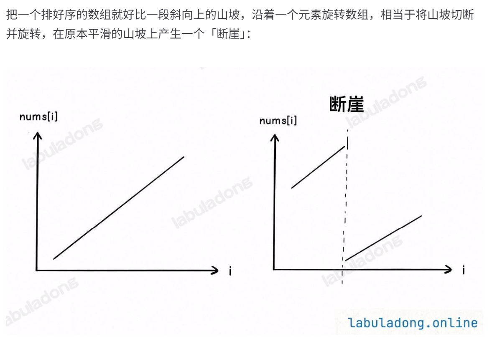

# Problem
https://labuladong.online/zh/problem/leetcode/search-in-rotated-sorted-array/description/


# Problem Description
整数数组 nums 按升序排列，数组中的值互不相同。

在传递给函数之前，nums 在预先未知的某个下标 k（0 <= k < nums.length）上进行了左旋转，使数组变为 [nums[k], nums[k+1], ..., nums[n-1], nums[0], nums[1], ..., nums[k-1]]（下标从 0 开始计数）。例如，[0,1,2,4,5,6,7] 在下标 3 处经左旋转后可能变为 [4,5,6,7,0,1,2]。注意 k = 0 时表示未旋转。

给你旋转后的数组 nums 和一个整数 target，如果 nums 中存在这个目标值 target，则返回它的下标，否则返回 -1。

你必须设计一个时间复杂度为 O(logn) 的算法解决此问题。

给你旋转后的数组 nums 和目标值 target，返回 target 在 nums 中的下标；若不存在，则返回 -1。


# Key Points


**本题需要关注的点是：断崖前一半的起点比后一半的终点还大**

还是使用left和right两个指针，比较nums[mid]……与target的大小：

如果mid落在断崖左侧，说明nums[left,mid]升序 -> 所以如果 nums[left] <= target < nums[mid]，则可以收缩right，否则应该收缩left；

落在右侧说明nums[mid,right]升序 -> 所以如果 nums[mid] <= target < nums[right]，则可以收缩left


# Code

## ACM version

**ACM 模式的注意点：**

```python
import sys 

class Solution:
    def searchRoll(self, nums, target):
        # 时间复杂度O(logn)，肯定用二分查找mid
        # 在任意位置mid切开，至少一半有序，如果左边有序，说明target在右边，以此类推
        left, right = 0, len(nums) - 1
        while left <= right:
            mid = (left + right) // 2
            if nums[mid] == target:
                return mid
            if nums[left] <= nums[mid]: # 左半段[left, mid]已经有序
                if nums[left] <= target < nums[mid]: # target在这段
                    right = mid - 1
                else: # target不在
                    left = mid + 1
            else: # 右半段[mid+1, right]有序
                if nums[mid] < target <= nums[right]:
                    left = mid + 1
                else:
                    right = mid - 1
        return -1 

data = sys.stdin.read().strip().split('\n')
idx = 0
while idx < len(data):
    n, target = map(int, data[idx].split()); idx += 1
    nums = list(map(int, data[idx].split())); idx += 1
    result = Solution().searchRoll(nums, target)
    print(result)
```


# Complexity Analysis
- 时间复杂度：O(logn)
- 空间复杂度：O(1)

# 搜索旋转排序数组II 
## 题目 
https://leetcode.cn/problems/search-in-rotated-sorted-array-ii/description/

已知存在一个按非降序排列的整数数组 nums ，数组中的值不必互不相同。

在传递给函数之前，nums 在预先未知的某个下标 k（0 <= k < nums.length）上进行了 旋转 ，使数组变为 [nums[k], nums[k+1], ..., nums[n-1], nums[0], nums[1], ..., nums[k-1]]（下标 从 0 开始 计数）。例如， [0,1,2,4,4,4,5,6,6,7] 在下标 5 处经旋转后可能变为 [4,5,6,6,7,0,1,2,4,4] 。

给你 旋转后 的数组 nums 和一个整数 target ，请你编写一个函数来判断给定的目标值是否存在于数组中。如果 nums 中存在这个目标值 target ，则返回 true ，否则返回 false 。

你必须尽可能减少整个操作步骤。

## Solution
回顾无重复版本的判断：

```python
if nums[left] <= nums[mid]:
    # 左半段 [left, mid] 有序
else:
    # 右半段 [mid, right] 有序
```

这个判断成立的前提是：nums[left] <= nums[mid] 能推出左半段有序。

但在有重复时，会出现这种情况：

```python
nums = [1, 1, 1, 3, 1]
left=0, mid=2, right=4
nums[left] = 1, nums[mid] = 1, nums[right] = 1
```

此时 nums[left] == nums[mid] == nums[right] = 1，你无法判断：

左半段 [1, 1, 1] 有序吗？看起来有序；右半段 [1, 3, 1] 有序吗？不是。

但仅凭 nums[left] <= nums[mid]，你会误以为左半段有序，然后去左半段找 3，结果找不到，而 3 其实在右半段。

根本原因：当三端相等时，mid 左边和右边都可能藏着「断点」，二分的「舍一半」逻辑失效。

## Code
```python
class Solution:
    def search(self, nums: list[int], target: int) -> bool:
        # 存在重复数字
        left, right = 0, len(nums) - 1
        while left <= right:
            mid = (left + right) // 2
            if nums[mid] == target:
                return True
            if nums[left] == nums[mid] == nums[right]: # 三端相等无法判断左右有序，各退一步
                left += 1
                right -= 1
            elif nums[left] <= nums[mid]: # 左边有序
                if nums[left] <= target < nums[mid]:
                    right = mid - 1
                else:
                    left = mid + 1
            else: # 右边有序
                if nums[mid] < target <= nums[right]:
                    left = mid + 1
                else:
                    right = mid - 1
        return False
```
