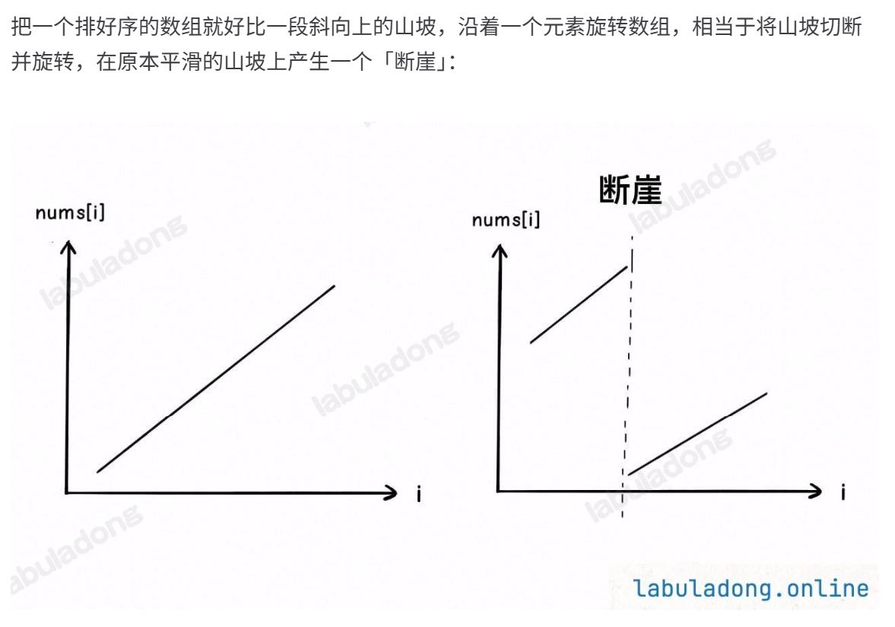

# Problem
https://labuladong.online/zh/problem/leetcode/search-in-rotated-sorted-array/description/


# Problem Description
整数数组 nums 按升序排列，数组中的值互不相同。

在传递给函数之前，nums 在预先未知的某个下标 k（0 <= k < nums.length）上进行了左旋转，使数组变为 [nums[k], nums[k+1], ..., nums[n-1], nums[0], nums[1], ..., nums[k-1]]（下标从 0 开始计数）。例如，[0,1,2,4,5,6,7] 在下标 3 处经左旋转后可能变为 [4,5,6,7,0,1,2]。注意 k = 0 时表示未旋转。

给你旋转后的数组 nums 和一个整数 target，如果 nums 中存在这个目标值 target，则返回它的下标，否则返回 -1。

你必须设计一个时间复杂度为 O(logn) 的算法解决此问题。

给你旋转后的数组 nums 和目标值 target，返回 target 在 nums 中的下标；若不存在，则返回 -1。


# Key Points


**本题需要关注的点是：断崖前一半的起点比后一半的终点还大**

还是使用left和right两个指针，比较nnums[mid]……与target的大小：如果mid落在断崖左侧，说明nums[left,mid]升序 -> 所以如果 nums[left] <= target < nums[mid]，则可以收缩right，否则应该收缩left；落在右侧说明nums[mid,right]升序 -> 所以如果 nums[mid] <= target < nums[right]，则可以收缩left


# Code

## LC version

```python
class Solution:
    def search(self, nums: List[int], target: int) -> int:
        left = 0
        right = len(nums) - 1
        while left <= right:
            mid = (left + right) // 2
            if nums [mid] == target:
                return mid
            if nums[mid] >= nums[left]: # 说明落在断崖左侧
                if nums[left] <= target and nums[mid] > target: # 上面已经排除了nums [mid] == target
                    right = mid - 1
                else:
                    left = mid + 1
            else: # 说明在断崖右侧
                if nums[mid] < target and target <= nums[right]:
                    left = mid + 1
                else:
                    right = mid - 1
        return -1   +
```

## ACM version

**ACM 模式的注意点：**

- 需要 import 完整的类（包括 sys、typing 等）
- 数据在标准输入流 stdin 中，全部是原始的文本字符串
- 必须用 print() 手动将结果写到标准输出流 stdout
- 需要写 while 或 for line in sys.stdin 循环处理，直到文件结束（EOF）

```python
import sys
from typing import List

class Solution:
    def searchRotate(self, nums: List[int], target: int) -> int:
        left, right = 0, len(nums) - 1
        while left <= right:
            mid = (left + right) // 2
            if nums[mid] == target:
                return mid
            if nums[mid] >= nums[left]: # 落在左侧断崖
                if nums[left] <= target and target < nums[mid]:
                    right = mid -1
                else:
                    left = mid + 1
            else: # 落在右侧
                if nums[right] >= target and target > nums[mid]:
                    left = mid + 1
                else:
                    right = mid - 1      
        return -1

data = sys.stdin.read().split()
index = 0
while index < len(data):
    n = int(data[index])
    index += 1
    target = int(data[index])
    index += 1
    nums = [int(x) for x in data[index: index+n]]
    index += n
    print(Solution().searchRotate(nums, target))
```


# Complexity Analysis
- 时间复杂度：O(logn)
- 空间复杂度：O(1)
