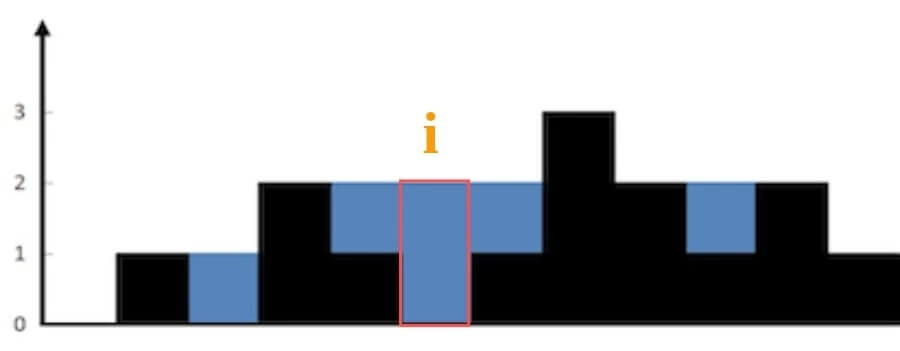

# Problem
https://labuladong.online/zh/problem/leetcode/trapping-rain-water/description/


# Problem Description
给定 n 个非负整数表示每个宽度为 1 的柱子的高度图，计算按此排列的柱子，下雨之后能接多少雨水。

数据范围：

n == height.length

1 <= n <= 2 * 10^4

0 <= height[i] <= 10^5


# Solution
先不考虑整个柱状图能装多少水，仅仅考虑位置 i 这一个位置能装下多少水？



能装 2 格水，因为 height[i] 的高度为 0，而这里最多能盛 2 格水，2-0=2。

为什么位置 i 最多能盛 2 格水呢？

因为，位置 i 能达到的水柱高度和其左边的最高柱子、右边的最高柱子有关，我们分别称这两个柱子高度为 l_max 和 r_max；位置 i 最大的水柱高度就是 min(l_max, r_max)。

也就是说，对于位置 i，能够装的水为：
```python
water[i] = min(
    # 左边最高的柱子
    max(height[0..i]),  
    # 右边最高的柱子
    max(height[i..end]) 
) - height[i]
```

# Code

## ACM version

**ACM 模式的注意点：**

- 需要 import 完整的类（包括 sys、typing 等）
- 数据在标准输入流 stdin 中，全部是原始的文本字符串
- 必须用 print() 手动将结果写到标准输出流 stdout
- 需要写 while 或 for line in sys.stdin 循环处理，直到文件结束（EOF）

```python
# 总体可以接雨水的量=每个柱子接雨水量相加之和（一共n个柱子）
# 第i个柱子可以接雨水的量（根据木板效应看短板）：min(max(height[0…i]), max(height[i…end]))-height[i]
# 需要求位置i的柱子左右最大值l_max/r_max -> 用备忘录list记录

import sys 

class Solution:
    def putRain(self, height):
        ans = 0
        n = len(height)

        l_max = [0] * n
        r_max = [0] * n
        l_max[0] = height[0] # 初始化，防止Outofindex
        r_max[n - 1] = height[n - 1] # 初始化，防止Outofindex

        # 求l_max和r_max
        for i in range(1, n):
            l_max[i] = max(height[i], l_max[i - 1])
        for i in range(n - 2, -1, -1):
            r_max[i] = max(height[i], r_max[i + 1])

        # 求ans
        for i in range(1, n - 1):
            ans += min(l_max[i], r_max[i]) - height[i]
            
        return ans
        
data = sys.stdin.read().strip().split("\n")
idx = 0
while idx < len(data):
    n = int(data[idx]); idx += 1
    height = list(map(int, data[idx].split())); idx += 1
    result = Solution().putRain(height)
    print(result)
```


# Complexity Analysis
- 时间复杂度：O(n)
- 空间复杂度：O(n)
