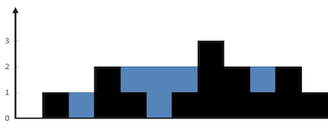

# Problem
https://labuladong.online/zh/problem/leetcode/trapping-rain-water/description/


# Problem Description
给定 n 个非负整数表示每个宽度为 1 的柱子的高度图，计算按此排列的柱子，下雨之后能接多少雨水。

数据范围：

n == height.length

1 <= n <= 2 * 10^4

0 <= height[i] <= 10^5




# Solution
先不考虑整个柱状图能装多少水，仅仅考虑位置 i 这一个位置能装下多少水？

能装 2 格水，因为 height[i] 的高度为 0，而这里最多能盛 2 格水，2-0=2。

为什么位置 i 最多能盛 2 格水呢？

因为，位置 i 能达到的水柱高度和其左边的最高柱子、右边的最高柱子有关，我们分别称这两个柱子高度为 l_max 和 r_max；位置 i 最大的水柱高度就是 min(l_max, r_max)。

也就是说，对于位置 i，能够装的水为：
```python
water[i] = min(
    # 左边最高的柱子
    max(height[0..i]),  
    # 右边最高的柱子
    max(height[i..end]) 
) - height[i]
```
这一部分的代码实现：
```python
def trap(height: List[int]) -> int:
    left, right = 0, len(height) - 1
    l_max, r_max = 0, 0
    
    while left < right:
        # l_max 是 height[0..left] 中最高柱子的高度，r_max 是 height[right..end] 的最高柱子的高度。
        l_max = max(l_max, height[left])
        r_max = max(r_max, height[right])
        left += 1
        right -= 1
```


# Code

## LC version

```python
from typing import List

class Solution:
    def trap(self, height: List[int]) -> int:
        left = 0
        right = len(height) - 1
        l_max = 0 
        r_max = 0

        ans = 0
        
        while left < right:
            l_max = max(l_max, height[left])
            r_max = max(r_max, height[right])
            if l_max < r_max:
                ans += l_max - height[left]
                left += 1
            else:
                ans += r_max - height[right]
                right -= 1

        return ans
```

## ACM version

**ACM 模式的注意点：**

- 需要 import 完整的类（包括 sys、typing 等）
- 数据在标准输入流 stdin 中，全部是原始的文本字符串
- 必须用 print() 手动将结果写到标准输出流 stdout
- 需要写 while 或 for line in sys.stdin 循环处理，直到文件结束（EOF）

```python
from typing import List
import sys

class Solution:
    def trap(self, height: List[int]) -> int:
        l_max, r_max = 0, 0
        left = 0
        right = len(height) - 1
        ans = 0
        
        while left < right:
            l_max = max(l_max, height[left])
            r_max= max(r_max, height[right])
            if l_max < r_max:
                ans += l_max - height[left] 
                left += 1 # 移动left因为木桶看短板，右边柱子高无所谓；这一格搞定了可看下一个
            else:
                ans += r_max - height[right]
                right -= 1

        return ans


for line in sys.stdin:
    n = int(line.strip())
    height = list(map(int, sys.stdin.readline().split()))

    result = Solution().trap(height)

    print(result)
```


# Complexity Analysis
- 时间复杂度：O(n)
- 空间复杂度：O(1)
