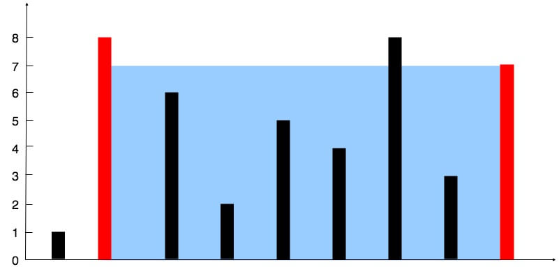

# Problem
https://labuladong.online/zh/problem/leetcode/container-with-most-water/description/


# Problem Description
给你一个长度为 n 的非负整数数组 height。在坐标系中画出 n 条垂直线，第 i 条线的两个端点分别为 (i, 0) 和 (i, height[i])。

找出其中两条线，使它们与 x 轴共同构成一个容器，使该容器能装最多的水，返回容器可以储存的最大水量。

说明：你不能倾斜容器。




# Solution
还是用左右指针方法，left 和 right 之间能够盛的容量为：
```python
min(height[left], height[right]) * (right - left)
```

# Code

## LC version

```python
class Solution:
    def maxArea(self, height: List[int]) -> int:
        left = 0
        right = len(height) - 1
        ans = 0
        while left < right:
            sum = min(height[left], height[right]) * (right - left)
            ans = max(ans, sum)
            # 移动矮的一遍，因为缩小高的一边肯定减小
            if height[left] < height[right]:
                left += 1
            else:
                right -= 1
        return ans
```

## ACM version

**ACM 模式的注意点：**

- 需要 import 完整的类（包括 sys、typing 等）
- 数据在标准输入流 stdin 中，全部是原始的文本字符串
- 必须用 print() 手动将结果写到标准输出流 stdout
- 需要写 while 或 for line in sys.stdin 循环处理，直到文件结束（EOF）

```python
import sys
from typing import List


class Solution:
    def maxArea(self, height: List[int]) -> int:
        left = 0
        right = len(height) - 1
        ans = 0
        while left < right:
            sum = min(height[left], height[right]) * (right - left)
            ans = max(ans, sum)
            # 移动矮的一遍，因为缩小高的一边肯定减小
            if height[left] < height[right]:
                left += 1
            else:
                right -= 1
        return ans
    

data = sys.stdin.read().split()
idx = 0
while idx < len(data):
    n = int(data[idx]); idx += 1
    height = [int(x) for x in data[idx:idx + n]]; idx += n
    result = Solution().maxArea(height)

    print(result)
```


# Complexity Analysis
- 时间复杂度：O(n)
- 空间复杂度：O(1)
