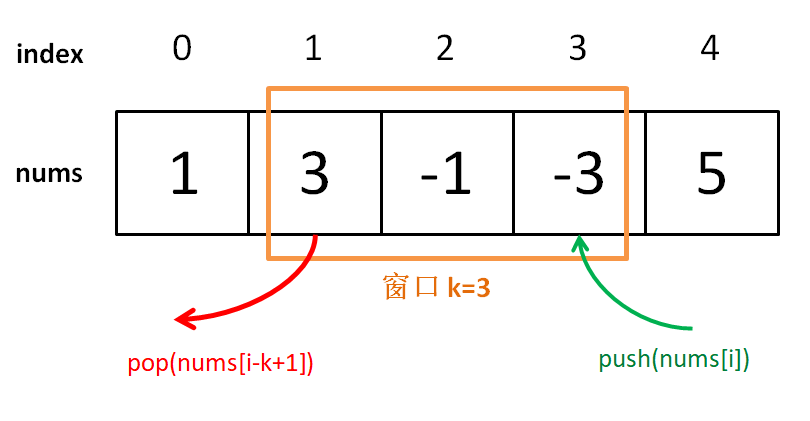
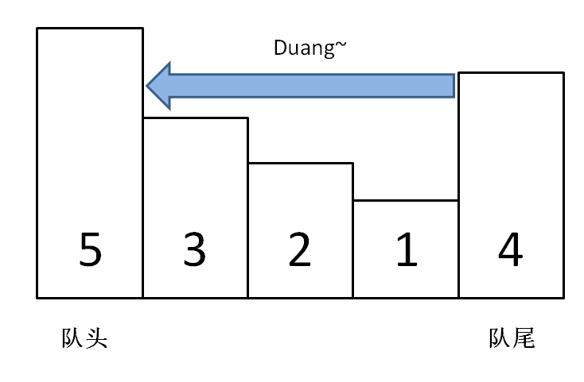

# Problem
https://labuladong.online/zh/problem/leetcode/sliding-window-maximum/description/


# Problem Description
给你一个整数数组 nums，有一个大小为 k 的滑动窗口从数组的最左侧移动到数组的最右侧。你只可以看到滑动窗口内的 k 个数字。滑动窗口每次向右移动一位。

请返回滑动窗口中的最大值组成的数组（按窗口从左到右的顺序）。

# Code

## LC version
按照滑动窗口常规思路，我的解法如下，但这样每次都要算max(window)，时间复杂度为O(nk)，time limits exceeded

```python
class Solution:
    def maxSlidingWindow(self, nums: List[int], k: int) -> List[int]:
        ans = []
        right = left = 0
        window = deque()
        while right < len(nums):
            window.append(nums[right])
            right += 1
            if right - left == k:
                ans.append(max(window))
                window.popleft()
                left += 1
        return ans
```

## ACM version

所以使用**单调队列**来解决这个问题，使用一个队列充当不断滑动的窗口window，每次滑动记录其中的最大值



如何在 O(1) 时间计算最大值，只需要一个特殊的数据结构「单调队列」，push 方法依然在队尾添加元素，但是要把前面比自己小的元素都删掉，直到遇到更大的元素才停止删除。




```python
# right向右扩大直到window大小=k，选取max，right和left继续向右移动
# 使用单调队列（滑动窗口最值问题）减小时间复杂度

import sys
from collections import deque

class MonotonicQueue:
    def __init__(self):
        self.q = deque()
        
    def push(self, k):
        while self.q and self.q[-1] < k: # 将小于 n 的元素全部删除
            self.q.pop()
        self.q.append(k) # 把k加入尾部
        
    def max(self):
        return self.q[0]
        
    def pop(self, k):
        if k == self.q[0]:
            self.q.popleft() # q保存可能最大的元素
        
class Solution:
    def windowMax(self, nums, k):
        ans = []
        window = MonotonicQueue()
        for i in range(len(nums)):
            if i < k - 1: # 先填满窗口的前k-1
                window.push(nums[i])
            else:
                window.push(nums[i]) # 最后一个数字
                ans.append(window.max()) # 更新max
                window.pop(nums[i - k + 1]) # window[i-k+1……i]
        return ans
        
data = sys.stdin.read().strip().split("\n")
idx = 0
while idx < len(data):
    n, k = map(int, data[idx].split()); idx += 1
    nums = list(map(int, data[idx].split())); idx += 1
    ans = Solution().windowMax(nums, k)
    print(' '.join(str(ch) for ch in ans))
```


# Complexity Analysis
- 时间复杂度：O(n)
- 空间复杂度：O(n)
