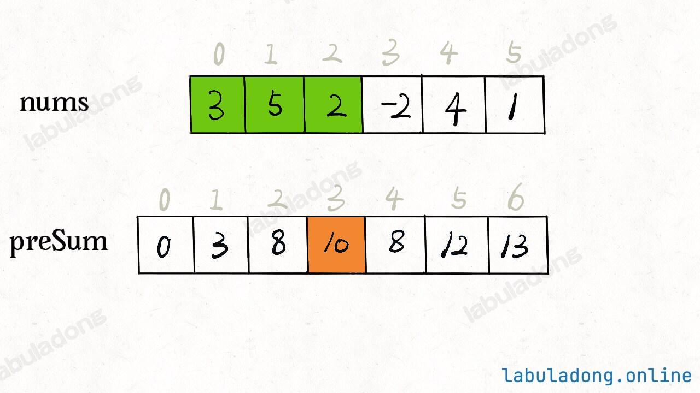
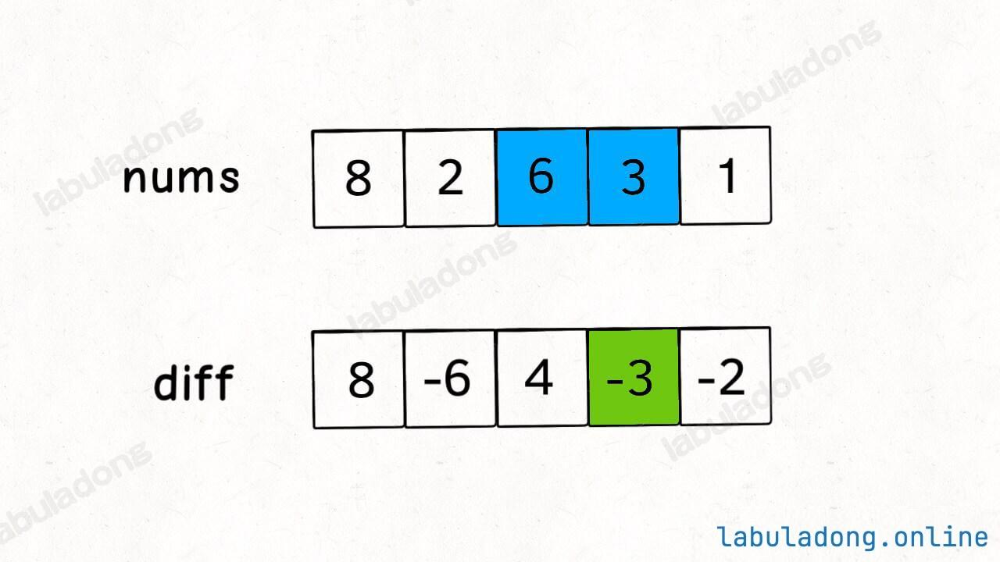
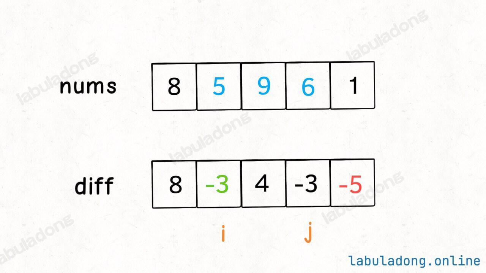

# Overview

由于是紧凑连续存储，可以随机访问，**通过索引快速找到对应元素**、时间复杂度 O(1)，而且相对节约存储空间。

但正因为连续存储，内存空间必须一次性分配够，所以说数组如果要**扩容**，需要重新分配一块更大的空间，再把数据全部复制过去，时间复杂度 O(N)；

而且你如果想在**数组中间进行插入和删除**，每次必须搬移后面的所有数据以保持连续，时间复杂度 O(N)；


# 数组增删改查基础实现方法（动态数组，封装了基本操作）

```python
# 创建动态数组
# 不用显式指定数组大小，它会根据实际存储的元素数量自动扩缩容
arr = []

# 在末尾追加元素，时间复杂度 O(1)
for i in range(10):
    arr.append(i)

# 在中间插入元素，时间复杂度 O(N)
arr.insert(2, 666) # 在索引 2 的位置插入元素 666

# 在头部插入元素，时间复杂度 O(N)
arr.insert(0, -1)

# 删除末尾元素，时间复杂度 O(1)
arr.pop()

# 删除中间元素，时间复杂度 O(N)
arr.pop(2) # 删除索引 2 的元素

# 根据索引查询元素，时间复杂度 O(1)
a = arr[0]

# 根据索引修改元素，时间复杂度 O(1)
arr[0] = 100

# 根据元素值查找索引，时间复杂度 O(N)
index = arr.index(666)
```

# 技巧汇总

## 1 前缀和
### 1.1 什么时候使用前缀和

1. 原数组 nums 不会发生变化，所有元素固定

2. 存在逆运算的场景。

   比方说求和的场景，你知道 x+6=10，那么可以推导出 x=10−6=4，求乘积的场景也是类似的，你知道 x∗6=12，那么可以推导出 x=12/6=2，这就叫存在逆运算，都可以使用前缀和技巧。

   但有些场景是没有逆运算的，比方说求最大值的场景，你知道 max(x,8)=8，此时你无法推导出 x 的值。

### 1.2 前缀和特别容易出现的问题：out of index

**前缀和问题中前缀和数组长度究竟是 n 还是 n + 1，遍历数组用的指针范围 range是多少？**

一维数组前缀和含义：preSum[i] = nums[0……i-1]之和，即 preSum[i] = preSum[i - 1] + nums[i - 1]

```python
class NumArray:
    def __init__(self, nums: List[int]):
        n = len(nums)
        self.preSum = [0] * (n + 1)
        for i in range(1, n):
            self.preSum[i] = self.preSum[i - 1] + nums[i - 1]
```

二维前缀和含义：矩阵 matrix[0, 0, i, j] 去掉 matrix[i,j] 的和

```python
class NumMatrix:
    def __init__(self, matrix: List[List[int]]):
        m = len(matrix)
        n = len(matrix[0])
        if m == 0 or n == 0:
            return

        self.preSum = [[0] * (n + 1) for _ in range(m + 1)]
        for i in range(1, m + 1):
            for j in range(1, n + 1):
                self.preSum[i][j] = (self.preSum[i - 1][j] + self.preSum[i][j - 1] +
                                     matrix[i - 1][j - 1] - self.preSum[i - 1][j - 1])
```

## 2 差分数组
### 2.1 什么时候使用差分数组？

**前缀和**技巧主要适用的场景是**原始数组不会被修改**的情况下，频繁查询某个区间的累加和。



preSum[i] 就代表着 nums[0..i-1] 所有元素的累加和，如果我们想求区间 nums[i..j] 的累加和，只要计算 preSum[j+1] - preSum[i] 即可，而不需要遍历整个区间求和。

**差分数组**的主要适用场景是**频繁对原始数组的某个区间的元素进行增减**。

我们先对 nums 数组构造一个 diff 差分数组，diff[i] = nums[i] - nums[i-1]，可以反推 nums[i] = nums[i - 1] + diff[i]



如果你想对区间 nums[i..j] 的元素全部加 3，那么只需要让 diff[i] += 3（**注意只有 diff[i] + 3**，而不是 diff[i…j] + 3），然后再让 **diff[j+1] -= 3** 即可：



diff[i] += 3 意味着给 nums[i..] 所有的元素都加了 3，然后 diff[j+1] -= 3 又意味着对于 nums[j+1..] 所有元素再减 3，那综合起来，是不是就是对 nums[i..j] 中的所有元素都加 3 了？这样修改 diff 数组和原始数组 nums，修改的时间复杂度是 O(1)

### 2.2 差分数组数字长度 n 和 range 的问题

**差分数组**问题中，**diff 的数组长度是 n（和原始数组一一对应）**，进行差分操作遍历数组的时候是 for i in range(1, n)，因为数组长度 n，最长遍历到 n - 1，另外为了防止 out of index，必须从 1 开始遍历

但是**前缀和**问题中，**preSum 数组长度一般是 n + 1**

```python
preSum[i] = nums[0] + nums[1] + ... + nums[i-1]
preSum[0] = 0

nums:      [a0, a1, a2, ..., a(n-1)]     长度 n
preSum:  [0, a0, a0+a1, ..., a0+...+a(n-1)]   长度 n+1
          ↑
       这个 0 是"前缀和的起点"
```

## 3 矩阵
矩阵问题，创建矩阵就是 matrix = [[0] * n for _ in range(n)]，出来的矩阵为[[1,2,3]……]形状

注意矩阵问题都可以考虑元素下标，即matrix[i][j]，从i/j入手

## 4 双指针

### 4.1 快慢指针
快慢指针类包含一般的快慢指针fast和slow，一般用于解决“**寻找重复数（nums有重复值的情况都可以）**”的问题，fast在前面探路找重复值，slow维护有效数组（保证**原地修改**），保证nums[0……slow]是满足题目要求的。

PS. 如果不是原地修改的话，我们直接 new 一个 int[] 数组，把去重之后的元素放进这个新数组中，然后返回这个新数组即可。但是现在题目让你原地删除，不允许 new 新数组，只能在原数组上操作，然后返回一个长度，这样就可以通过返回的长度和原始数组得到我们去重后的元素有哪些了。

但是滑动窗口本质也是同向双指针、可以分进快慢指针一类，分成**可变/固定长度**的滑动窗口，用于处理**最长最短子串/子数组**的问题，像**毛毛虫**一样蠕动window可以解决的话就考虑用滑动数组。

#### 4.1.1 快慢指针
fast在前面找目标值（重复值/val），slow维护nums[0……slow]满足题目要求，注意遍历的条件和slow/fast++的位置，以及最后返回值return和slow/fast的数学关系。

这类题目在纸笔上模拟。

#### 4.1.2 滑动窗口

1. 什么时候扩大窗口？扩大right需要更新什么？
2. 什么时候缩小窗口？缩小left需要更新什么？
3. 什么时候更新结果？

然后写实现细节，首先->然后……

注意写代码的时候：

1. 维护window、need(valid来衡量)，长度问题涉及length（如何用right/left表示，要不要+1-1）
2. right/left++和更新的前后序问题
3. 条件判别，if还是while

### 4.2 左右指针
一般初始值left, right = 0, len(nums) - 1，然后条件是while left <= right（要不要=，把边界条件拎出来看）

左右指针常见题型：n数之和、接雨水、二分查找

#### 4.2.1 啥时候使用二分查找

要求时间复杂度为O(logn)的

##### 4.2.1.1 从基础的二分查找开始
搜索一个数，如果存在返回其索引，否则返回 -1
```python
class Solution:
    def search(self, nums: list[int], target: int) -> int:
        # 在nums中搜索target，已知nums升序
        left, right = 0, len(nums) - 1
        while left <= right: 
            # 终止条件是left = right + 1,此时[right+1, right]没有合法数字
            # 如果left<right，终止在[right, right]，漏掉这个数字
            mid = (left + right) // 2
            if nums[mid] < target:
                left = mid + 1
            elif nums[mid] > target:
                right = mid - 1
            elif nums[mid] == target:
                return mid
        return -1
```

讨论一下隐含细节：

1. left = 0, right = len(nums) -1 ，使得查找区间两段都闭，因为从数组的第一个元素、最后一个元素开始
  
2. while left <= right，为什么是<=而不是<：while(left <= right) 的终止条件是 left == right + 1，此时的搜索区间是 [right + 1, right]，没有元素既大于等于 right+1 又小于等于 right，所以搜索区间为空，while 循环终止是正确的。如果使用 while(left < right)，终止条件是 left == right，写成区间的形式就是 [left, left]，这时候搜索区间还有一个元素，但 while 循环终止了，就会漏掉这个元素，如果目标值恰好是这个元素，算法就会误以为目标值不存在。

3. 为什么是 left = mid + 1, right = mid - 1：因为 mid 已经搜索过，应该从搜索区间中去除。因为我们的搜索区间是两端都闭的 [left, right]。当我们发现索引 mid 不是要找的 target 时，搜索区间应该收缩为 [left, mid-1] 或者区间 [mid+1, right]。

4. 上述算法的缺点：比如说给你有序数组 nums = [1,2,2,2,3]，target 为 2，此算法返回的索引是 2，没错。但是如果我想得到 target 的左侧边界，即索引 1，或者我想得到 target 的右侧边界，即索引 3，这样的话此算法是无法处理的。你也许会说，找到一个 target，然后向左或向右线性搜索不行吗？可以，但是这样难以保证二分查找对数级的复杂度了。


##### 4.2.1.2 寻找左右侧边界（nums存在重复元素时）的二分查找
查找左侧边界，如果存在返回其索引，否则返回 -1
```python
class Solution:
    def left_search(self, nums: List[int], target: int) -> int:
        left = 0
        right = len(nums) - 1 
        while left <= right:
            mid = (left + right) // 2 
            if nums[mid] < target:
                left = mid + 1
            elif nums[mid] > target:
                right = mid - 1
            elif nums[mid] == target: # 因为要找的是左侧边界，所以这个时候不能直接返回，要继续向左侧缩小
                right = mid - 1
        # 检查出界情况
        if left > len(nums)-1 or nums[left] != target:
            return -1
        return left 
```

注意点：
1. 如果这个左侧边界是存在的，以“nums = [1,2,2,2,3]，target 为 2”为例，索引[0,1,2,3,4]，开始left=0,right=4,mid=2->2，进一步缩小左边界，right=1，现在mid=0->1<target==2，left=1，left和right重合，结束，left指向的就是左侧边界

2. 如果左侧边界不存在，以“nums = [2,3,5,7], target = 4”为例，索引[0,1,2,3]，开始left=0,right=3,mid=1->3<target==4，所以left=2,right=3,mid=2->5>target==4，所以right=1,left=2不满足while条件，所以退出循环，返回left=2->对应5，是**大于target的最小索引**


查找右侧边界，如果存在返回其索引，否则返回 -1
```python
class Solution:
    def right_search(self, nums: List[int], target: int) -> int:
        left = 0
        right = len(nums) - 1 
        while left <= right:
            mid = (left + right) // 2 
            if nums[mid] < target:
                left = mid + 1
            elif nums[mid] > target:
                right = mid - 1
            elif nums[mid] == target: # 因为要找的是右侧边界，所以这个时候不能直接返回，要继续向右侧缩小
                left = mid + 1
        # 检查出界情况
        if right < 0 or nums[right] != target:
            return -1
        return right
```
