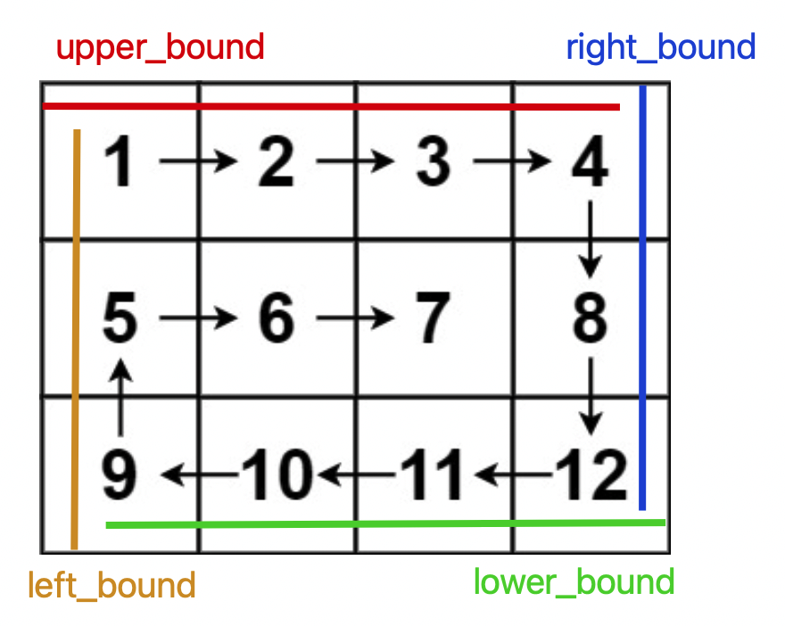

# Problem
https://labuladong.online/zh/problem/leetcode/spiral-matrix/description/


# Problem Description
给你一个 m 行 n 列的矩阵 matrix，请按顺时针螺旋顺序返回矩阵中的所有元素。

螺旋顺序的遍历方向依次为：从左到右 → 从上到下 → 从右到左 → 从下到上，由外向内不断收缩。

# Solution

确定边界upper/lower/left/right，不断缩小边界来遍历，注意矩阵问题都可以考虑**矩阵坐标 matrix[i][j]**



# Code

## LC version

```python
class Solution:
    def spiralOrder(self, matrix: List[List[int]]) -> List[int]:
        # 完整的一圈是左右->上下->左右->上下：matrix[0][j] -> matrix[i][-1] -> matrix[-1][j]……
        
        m, n = len(matrix), len(matrix[0])
        upper_bound, lower_bound = 0, m - 1
        left_bound, right_bound = 0, n - 1 # 四个边界圈定未遍历的子矩阵
        ans = []

        while len(ans) < m * n: # len(res) == m * n 时遍历完整个矩阵
            if upper_bound <= lower_bound:
                for j in range(left_bound, right_bound + 1):
                    ans.append(matrix[upper_bound][j])
                upper_bound += 1
            if left_bound <= right_bound:
                for i in range(upper_bound, lower_bound + 1):
                    ans.append(matrix[i][right_bound])
                right_bound -= 1
            if upper_bound <= lower_bound:
                for j in range(right_bound, left_bound - 1, -1): # 倒着遍历
                    ans.append(matrix[lower_bound][j])
                lower_bound -= 1
            if left_bound <= right_bound:
                for i in range(lower_bound, upper_bound - 1, -1):
                    ans.append(matrix[i][left_bound])
                left_bound += 1

        return ans
```

## ACM version

**ACM 模式的注意点：**

- 需要 import 完整的类（包括 sys、typing 等）
- 数据在标准输入流 stdin 中，全部是原始的文本字符串
- 必须用 print() 手动将结果写到标准输出流 stdout
- 需要写 while 或 for line in sys.stdin 循环处理，直到文件结束（EOF）

```python
import sys 


class Solution:
    def rollMatrix(self, matrix):
        m, n = len(matrix), len(matrix[0])
        ans = []
        upper , lower = 0, m - 1
        left, right = 0, n -1
        
        while len(ans) < m * n: # ans遍历完应该长度为mn
            if upper <= lower: # 遍历行
                for j in range(left, right + 1):
                    ans.append(matrix[upper][j])
                upper += 1

            if left <= right: # 遍历列
                for i in range(upper, lower + 1):
                    ans.append(matrix[i][right])
                right -= 1

            if upper <= lower:
                for j in range(right, left - 1, -1): # 最小遍历到left，所以右边界是left-1
                    ans.append(matrix[lower][j])
                lower -= 1

            if left <= right:
                for i in range(lower, upper - 1, -1):
                    ans.append(matrix[i][left])
                left += 1
                
        return ans # ans已经是['1','2'……]
 

data = sys.stdin.read().strip().split('\n')
idx = 0
while idx < len(data):
    m, n = map(int, data[idx].split()); idx += 1 # ['3','4']
    matrix = []
    for _ in range(m):
        matrix.append(list(map(int, data[idx].split())))
        idx += 1
    result = Solution().rollMatrix(matrix)
    print(' '.join(map(str, result)))
```


# Complexity Analysis
- 时间复杂度：O(mn)
- 空间复杂度：O(1)
