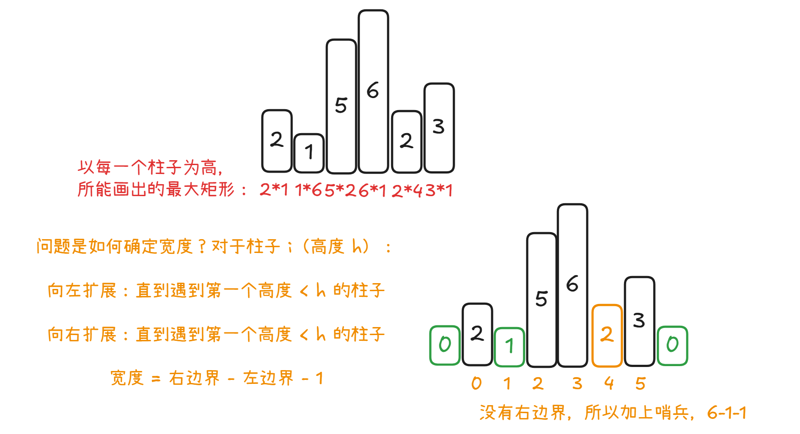

# Problem
https://labuladong.online/zh/problem/leetcode/largest-rectangle-in-histogram/description/


# Problem Description
给定 n 个非负整数，用来表示柱状图中各个柱子的高度。每个柱子彼此相邻，且宽度为 1。

求在该柱状图中，能够勾勒出来的矩形的最大面积。


# Key Points
柱子求面积问题：都从每个柱子思考怎么求全局解

但是这题和接雨水问题不一样，不是看每一格子的大小，要进行全局比较

核心思想：每个柱子都可能成为矩形的高

柱状图：[2, 1, 5, 6, 2, 3]



1. 以每个柱子为高，可能的最大矩形
2. 如何计算出来的，处理宽：如果他构成高，那么左右边界就是比他矮的第一个柱子
3. 注意加上哨兵：因为条件是h[stack[-1]] > h[i]，如果数组是单调递增的，比如 [1, 2, 3, 4, 5]，一直没法触发条件、全都挤压在栈里面
4. 用单调栈实现：栈用来存放每一个待计算面积的柱子，然后遇到比栈里面小的元素说明边界来了，栈顶元素弹出来计算它的面积大小


# Code

## ACM version


```python
import sys 

class Solution:
    def largestRectangleArea(self, heights):
        # 求每个位置柱子所能组成的矩形最大值，然后求max即可
        # 这道题从左往右遍历即可
        # 每个位置最大值：如果他构成高，那么左右边界就是比他矮的第一个柱子

        # 两侧各加一个高度为0的哨兵，防止out of index
        h = [0] + heights + [0]
        stack = [] # 单调递增栈，栈顶最大，存储的是索引
        max_area = 0

        for i in range(len(h)):
            while stack and h[stack[-1]] > h[i]: # 肯定用最大的高度结算
                height = h[stack.pop()]
                width = i - stack[-1] - 1 # 从左到右遍历，stack[-1]肯定更小；i是右边界，stack单调递增、所以此时还没有pop的stack[-1]就是左边最大值
                max_area = max(max_area, height * width)
            stack.append(i)

        return max_area

data = sys.stdin.read().strip().split('\n')
idx = 0
while idx < len(data):
    n = int(data[idx]); idx += 1
    heights = list(map(int, data[idx].split())); idx += 1
    ans = Solution().largestRectangleArea(heights)
    print(ans)
```


# Complexity Analysis
- 时间复杂度：O(n)
- 空间复杂度：O(n)
