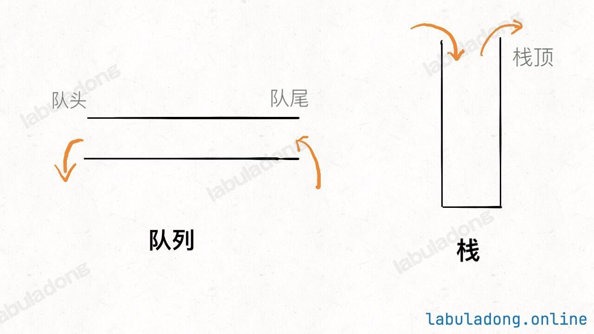

计算机的两种存储方式，顺序存储（数组）和链式存储（链表）都讲完了，之后的所有数据结构都是基于这两种存储方式之上玩花活。

其实队列和栈都是「操作受限」的数据结构。说它操作受限，主要是和基本的数组和链表相比，它们提供的 API 是不完整的。

比方说我们前面实现的数组和链表，增删查改的 API 都实现过了，你可以对任意一个索引元素进行增删查改，只要索引不越界，就随便你。

但是对于队列和栈，它们的操作是受限的：队列只能在一端插入元素，另一端删除元素；栈只能在某一端插入和删除元素。形象地理解，队列只允许在队尾插入元素，在队头删除元素，栈只允许在栈顶插入元素，从栈顶删除元素。

**队列是一种「先进先出」的数据结构，栈是一种「先进后出」的数据结构**



```python
# 队列
class MyQueue:
    # 向队尾插入元素，时间复杂度O(1)
    def push(self,e):
        pass
    # 从队头删除元素，时间复杂度O(1)
    def pop(self):
        pss
    # 查看队头元素，时间复杂度O(1)
    def peek(self):
        pass
    # 返回队列中的元素个数，时间复杂度O(1)
    def size(self):
        pass

# 栈
class MyStack:
    # 向栈顶插入元素，时间复杂度O(1)
    def push(self,e):
        pass
    # 从栈顶删除元素，时间复杂度O(1)
    def pop(self):
        pass
    # 查看栈顶元素，时间复杂度O(1)
    def peek(self):
        pass
    # 返回栈中元素个数，时间复杂度O(1)
    def size(self):
        pass
```
