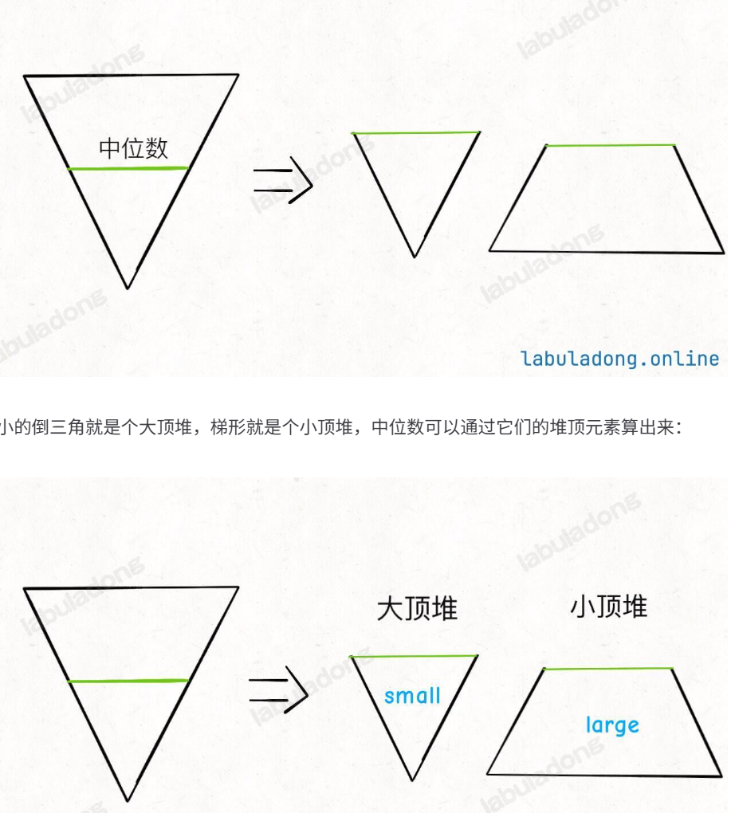

# Problem
https://labuladong.online/zh/problem/leetcode/find-median-from-data-stream/description/


# Problem Description

中位数是有序整数列表中的中间值。如果列表的大小是偶数，则没有中间值，中位数是两个中间值的平均值。

例如 arr = [2,3,4] 的中位数是 3。
例如 arr = [2,3] 的中位数是 (2 + 3) / 2 = 2.5。
实现 MedianFinder 类：

MedianFinder()：初始化 MedianFinder 对象。
void addNum(int num)：将数据流中的整数 num 添加到数据结构中。
double findMedian()：返回到目前为止所有元素的中位数。
为保证答案唯一：判题端在比较输出时会对每个 findMedian 结果保留 5 位小数，请按相同精度构造你的实现。


# Solution
本题核心是使用2个优先级队列（堆）：



Python 的 heapq 只提供小顶堆（min heap），如何模拟大顶堆？

把所有数字都变成负数。例如原来的数字5、2、8变成-5、-2、-8放进小顶堆。因为小顶堆会认为-8 < -5 < -2，所以最先弹出的是-8，再取负号，于是就得到了原来的最大值8。


# Code

## ACM version

```python
import heapq
import sys

class MedianFinder:
    def __init__(self):
        self.left = []
        self.right = []
        
    def addNum(self, val):
        # 先加入大顶堆（左）
        heapq.heappush(self.left, -val)
        # 因为左边要保证数字都比右边小，所以把左边最大值移到右边直到左堆最多比右堆多 1 个
        heapq.heappush(self.right, -heapq.heappop(self.left)) # -heapq.heappop是为了还原原来的值
        if len(self.right) > len(self.left):
            heapq.heappush(self.left, -heapq.heappop(self.right))
            
    def findMedian(self):
        if len(self.left) > len(self.right): # 说明数据流为奇数len
            return -self.left[0]
        else: # 说明数据流为偶数len
            return (-self.left[0] + self.right[0]) / 2

data = sys.stdin.read().strip().split('\n')
idx = 0
while idx < len(data):
    ops = int(data[idx])
    idx += 1
    dui = MedianFinder()
    for _ in range(ops):
        parts = data[idx].split()
        if parts[0] == 'add':
            dui.addNum(int(parts[1]))
        else:
            print(dui.findMedian())
        idx += 1
```

# Complexity Analysis
- 时间复杂度：O(logn)
- 空间复杂度：O(n)
